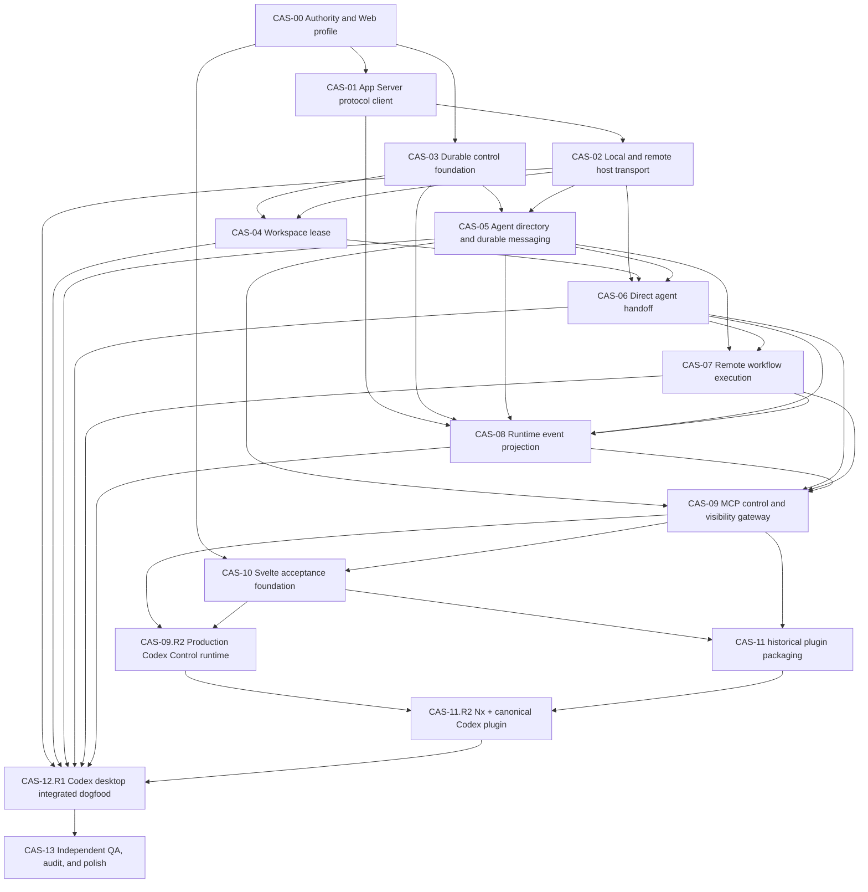

# Codex App Server Embrace — Seam DAG

**Status:** `ui_and_temp_repairs_active_dogfood_held` / `PHASE_LOCKED`  
**Date:** 2026-09-01  
**Phase lock:** implemented predecessor packets → CAS-UI-R2 → CAS-TEMP-R1 → CAS-12.R1 re-entry → `BASE_READY`; no dogfood before both active repair terminals  
**Current candidate:** detached `b9dc01512975a8b11bc673b5ec906c818dd708f6` with the uncommitted Svelte activation scaffold  
**Superseded campaign:** Herdr bridge work preserved in stash `898240b7dafabde67950ed00ae2ade199af6e750`

**Branch governance:** [CAS branch governance](cas-branch-governance.md) adopts
the repository's git-branch hierarchy for future CAS tasks while preserving
the current bounded shared-worktree custody exception. Jira is suspended;
existing CAS seam IDs are local task IDs. This checkpoint authorizes no Git
topology change.

## 0. Planning boundary

**Provider-backed test budget:** follow
[the Founder live test limits](codex-control-live-test-budget.md): GPT-5.6 low
by default, maximum four test agents per validation run, with one Sol-medium
and one Luna/Terra-high exception for required mixed-effort proof. Prefer
synthetic matrices and avoid unnecessary paid reruns. The demo is separately
authorized and remains gated.

**Implemented predecessor gate — CAS-WA-01:** retain the TypeScript
defineWorkflow/agent/parallel/phase API and make trusted workflow files launchable
in one Codex Control call, returning a stable run handle and Browser URL. The
daemon resolves compilation, source identity and registration under existing
authority; App Server executes agents. No SDK fallback or new DSL.
See [the charter](../goals/codex-app-server/CAS-WA-01.md).
Its implementation packet is complete evidence, not final acceptance.
CAS-12.R1 and the landing-page demo remain on HOLD until the active UI/temp
repairs and runtime/presentation setup are ready.

**Founder runtime-profile disposition:** named Codex configuration profiles are
deferred. CAS-RP-01 must support explicit model/effort combinations approved in
execution assignments, with no silent substitution. See
[the versioned disposition](../goals/codex-app-server/CAS-RP-01-PROFILE-DEFERRAL.md).
The demo uses Luna-high builders and a Sol-medium design judge. Native named-profile
support is not a Base or demo admission gate.

**Implemented predecessor repair — CAS-RP-01:** Founder superseded medium-only
agent reasoning. [Explicit Agent Runtime Profiles](../goals/codex-app-server/CAS-RP-01.md)
preserves exact model/effort propagation and provider validation with no silent
defaults or substitution. Its implementation evidence does not unlock CAS-13,
campaign audits, or Base acceptance. Runtime configuration and authenticated
Tailscale ingress remain separate admission prerequisites.

**MANDATORY FINAL POLISH CARRY-FORWARD:** seven confirmed package violators:
process, db, delivery, codex, control-gateway, workflows, and testing.
See [the structural polish register](codex-control-structural-polish.md).
Founder temporarily defers existing structural violations from Base; new code
must comply with BOTH File System and Clean Code. Ponytail grants no exemption.
Transport is unassessed, not cleared. This ruling does not unlock auditors.

This document is the complete dependency and ownership plan for making Codex App Server the canonical runtime for:

1. local and remote background Codex agents;
2. direct local and remote agent handoffs;
3. executable TypeScript workflows whose agent nodes run against a selected remote Codex App Server;
4. durable local/remote agent-to-agent communication; and
5. a read-only Svelte visibility plane opened beside the orchestrating Codex thread in the desktop app's in-app Browser.

Implementation is authorized only through immutable campaign assignments. The
current campaign remains `PHASE_LOCKED` at the active UI/temp repairs and held
integrated dogfood; no audit, Final Polish, or Base claim may bypass that order.

## 1. Founder rulings and source authority

### 1.1 Current explicit rulings

- Codex App Server is the canonical backend for Codex background agents.
- Herdr, tmux, terminal scraping, and SSH process control are absent from the canonical Codex path.
- Direct remote App Server communication uses an authenticated remote App Server endpoint; it does not silently fall back to SSH.
- Herdr may return later only as a new adapter when a non-Codex harness creates a real second implementation need.
- PostgreSQL process state remains durable truth; pg-boss remains the only delivery and retry-timing authority.
- The ChatGPT component is a visibility plane. Control remains through typed MCP tools and the active control thread.
- Svelte 5, Vite, and Nx own the Web client.
- Only the selected expanded agent streams detailed feed data to the UI; other agents contribute summary projections only.
- Agents require durable addressed messaging with delivery acknowledgement, replay, deduplication, asks, replies, and offline delivery.
- Agent-facing APIs are task-level and tool-call efficient: common orchestration sequences collapse into one authorized call with a stable handle rather than exposing chatty App Server JSON-RPC choreography.
- Safety is never compressed away: destructive confirmation, authorization, idempotency, cancellation, observability, and precise errors remain explicit.
- `PHASE_LOCKED` keeps the campaign in Base Foundation until every allocated Base seam reaches its terminal.
- In this repository, **Codex** means coding-agent threads inside the ChatGPT desktop app with project, worktree, MCP, Browser, and App Server context. **ChatGPT** means `chatgpt.com` Chat/Work and is not a canonical Base surface.
- A successful `delegate_agent` or `run_workflow` call returns one stable handle and one complete loopback Browser presentation. The Codex agent's next tool call uses `browser:control-in-app-browser` to open that view beside the thread.
- The shipped artifact is `.codex/plugins/codex-control/` (repository path `plugins/codex-control/`): a real `@nx/plugin` project and a canonical Codex plugin with `.codex-plugin/plugin.json`, bundled `skills/`, `.mcp.json`, and repo marketplace installation.
- ChatGPT Developer Mode, registered ChatGPT apps, MCP Apps iframe rendering, and Secure MCP Tunnel are optional compatibility surfaces and do not gate `BASE_READY`.

### 1.2 Governing inputs

- Repository: `AGENTS.md`, `GUIDELINES.md`, `README.md`, `TESTING.md`, `DOMAINS.md`, and current source/tests.
- Agent Wiki, read-only: `Clean Code` v3.1.0, `File System`, `TESTING` v1.1.0, `BATDD`, and `codex/orchestration/SPEC`.
- Official OpenAI documentation: Codex App Server, Codex plugins, local/repo marketplaces, and the desktop in-app Browser.
- Official Nx documentation: `@nx/plugin:plugin`, `@nx/plugin:generator`, generated plugin lint/build/test structure, and generator E2E conventions.
- External inspiration only: `dataforxyz/agent-intercom-codex` protocol-v3 delivery semantics. No code is copied and no AGPL dependency is introduced.

### 1.3 Known authority conflicts

- The Agent Wiki orchestration specification still recommends tmux as canonical transport. The current explicit Founder ruling supersedes it inside this repository. Wiki mutation is not authorized by this plan.
- `.agents/batdd/profile.json` still declares Web not applicable. CAS-00 must compile and ratify a Web-capable profile before any behavioral UI implementation.
- Official documentation labels the TCP WebSocket App Server transport experimental. Remote WSS admission therefore requires explicit version, TLS, authentication, reconnect, and fail-closed gates. No fallback transport is inferred.

## 2. Top-level seam classification

**Seam ID/name:** `CAS-V1 / Codex control plane`  
**Actor and outcome:** one human uses one control thread to launch, hand off, coordinate, and inspect Codex work across projects and hosts without switching terminals or copying context.  
**Class:** vertical product seam with provider/protocol, persistence, platform, and orchestration sub-seams.  
**Problem/change vector:** Codex agents are currently process-local SDK turns with coarse workflow journals; there is no durable remote runtime registry, cross-host messaging, handoff control, or rendered visibility plane.  
**Interface and invariants:** stable agent/workflow/message handles; App Server version negotiation; explicit authority; idempotent commands; ordered events; bounded/redacted visibility; cancellation and cleanup; no terminal-state inference.  
**Current callers:** `codex-workflows`, the active ChatGPT/Codex task, future `codex-control` MCP tools, and the Svelte component.  
**Historical baseline adapters:** `@openai/codex-sdk`, a local JSON journal, a
disposable App Server stdio spike, and controlled test executables. The current
candidate instead uses the version-pinned App Server client, local Unix/stdio
and authenticated WSS host transport, and daemon-backed durable control.  
**Deletion result:** without the control-plane seam, runtime, delivery, messaging, and UI responsibilities spread into every workflow and caller. The seam earns existence.  
**Variation result:** local stdio/unix and remote authenticated WSS are two current transport mechanics; persistent and controlled repositories are two required test implementations. Herdr is hypothetical for V1 and is excluded.  
**Dependencies/blockers:** App Server version pin; generated schema; remote TLS/auth endpoint; Web BATDD profile; PostgreSQL/pg-boss foundation; production daemon/control composition; Codex local plugin installation; in-app Browser availability.  
**Owning surface:** domain packages provide contracts, provider packages implement them, applications compose them, the plugin packages the MCP/UI surface.  
**Highest faithful test:** local and remote real App Server L2 plus a fresh Codex desktop task that invokes Codex Control and opens/interacts with the live Browser view.  
**Recommendation:** deepen existing workflow/Codex/process modules; selectively salvage generic control-plane work; do not revive the Herdr bridge or create a second orchestration authority.

## 3. End-state topology

```text
Human
  │
  ▼
One Codex control thread in the desktop app
  ├── call 1: typed Codex Control MCP intent
  └── call 2: browser:control-in-app-browser opens returned loopback URL
            │
            ▼
        Svelte Codex Control Browser view
            │ snapshot + bounded cursor waits
            ▼
        loopback Codex Control runtime
            │ commands / queries
            ▼
      one Nest control-plane daemon
      ├── PostgreSQL process + message ledger
      ├── pg-boss delivery/recovery
      ├── workflow engine
      ├── visibility projection
      └── App Server host registry
            ├── local: managed daemon via unix/proxy stdio
            └── remote: authenticated WSS through TLS
                     │
                     ▼
                Codex App Server
                ├── threads / turns
                ├── streamed item events
                ├── approvals / interruption
                ├── command execution
                └── configured control-plane MCP tools
```

App Server owns Codex conversation and runtime mechanics. PostgreSQL owns orchestration, messaging, delivery, and visibility truth. The iframe owns ephemeral presentation state only.

## 4. Stable owned interfaces

The names below are planning contracts. CAS-00 freezes exact schemas before implementation.

### 4.1 Runtime host

```ts
type AppServerHostRef = {
  hostId: string;
  transport: 'local-proxy' | 'remote-wss';
  endpoint: string;
  credentialRef?: string;
  expectedVersion: string;
};

type AgentRuntimeRef = {
  agentId: string;
  hostId: string;
  threadId: string;
  sessionId: string;
  activeTurnId?: string;
};

interface AgentRuntimePort {
  start(request: AgentStartRequest): Promise<AgentRuntimeRef>;
  deliver(request: AgentDeliveryRequest): Promise<AgentDeliveryAck>;
  interrupt(request: AgentInterruptRequest): Promise<void>;
  read(ref: AgentRuntimeRef): Promise<AgentRuntimeSnapshot>;
  events(ref: AgentRuntimeRef, cursor?: string): AsyncIterable<RuntimeEvent>;
}
```

The port is domain-owned. App Server JSON-RPC types, credentials, transport frames, and provider errors do not escape it.

### 4.2 Handoff

```ts
type DelegateAgentCommand = {
  idempotencyKey: string;
  assignmentRef: string;
  assignmentDigest: `sha256:${string}`;
  hostId: string;
  workspaceRef: string;
  runtimeProfileRef: string;
  completionBoundary: 'runtime-settled' | 'output-validated' | 'ready-for-audit';
};

type AgentHandle = {
  delegationId: string;
  executionId: string;
  agentId: string;
  hostId: string;
  threadId: string;
};
```

No caller supplies raw host paths, credentials, arbitrary App Server methods, or shell commands.

### 4.3 Durable agent messaging

```ts
type AgentMessageCommand = {
  messageId: string;
  idempotencyKey: string;
  fromAgentId: string;
  toAgentId: string;
  kind: 'send' | 'ask' | 'reply' | 'handoff' | 'status';
  correlationId?: string;
  body: string;
};

type AgentMessageState = 'queued' | 'leased' | 'app-server-accepted' | 'thread-observed' | 'replied' | 'failed' | 'expired';
```

Semantics:

- persistence precedes delivery;
- exact replays return the original handle;
- conflicting idempotency reuse fails with no state change;
- disconnect after possible acceptance is ambiguous, never blindly retried;
- reconciliation reads the target thread for the stable message marker;
- an active compatible turn receives `turn/steer` with `expectedTurnId`;
- an idle agent receives `turn/start`;
- `thread/inject_items` is context-only and never claimed as wake delivery;
- delivery acknowledgement and semantic reply are distinct states;
- message bodies are bounded and stored behind scoped database authority, never copied into public process events or logs.

### 4.4 Remote workflow execution

```ts
type RunWorkflowCommand = {
  workflowRef: string;
  sourceDigest: `sha256:${string}`;
  input: unknown;
  hostId: string;
  workspaceRef: string;
  runtimeProfileRef: string;
  idempotencyKey: string;
};
```

V1 placement is run-level: every agent node in one workflow run targets one selected App Server host/workspace. Per-node multi-host scheduling is deferred until a real workflow requires it.

`ExecuteWorkflowOptions.executeAgent` remains the provider-neutral execution seam. It gains stable node identity and a bounded runtime-event callback; it does not gain App Server JSON-RPC types.

### 4.5 Visibility

```ts
type ControlSnapshot = {
  cursor: string;
  projects: ProjectSummary[];
  workflows: WorkflowSummary[];
  agents: AgentSummary[];
  decisions: DecisionSummary[];
};

type WaitVisibilityQuery = {
  afterCursor: string;
  selectedAgentId?: string;
  waitMs: number;
};
```

The summary stream includes all agents. Detailed message/command/tool deltas include only `selectedAgentId`. Collapsing an agent stops renewal of its detail wait. Final `item/completed` and `turn/completed` projections are authoritative; deltas are coalesced advisory presentation state.

### 4.6 Agent-facing task API and tool-call economy

Agent tools expose user intent, not App Server method order. The daemon owns admitted-host lookup, workspace/runtime binding, thread/turn selection, persistence, reconciliation, and stable-handle creation behind each call.

Default representative budgets:

- `delegate_agent`: one call returns `AgentHandle`; callers do not separately create a workspace, thread, turn, or runtime binding;
- `send_agent_message` / `ask_agent` / `reply_agent`: one call persists and routes the message, returning message/correlation state;
- `run_workflow`: one call validates placement and returns a durable run handle;
- snapshot/wait tools: one cursor-bearing call returns the bounded current delta without list-then-get-then-subscribe choreography.

Every agent-facing Green Contract records the baseline tool-call count and compact result shape. Increasing that count or requiring callers to know provider sequencing is a contract regression. A separately authorized destructive confirmation or human decision may add an explicit call; efficiency never bypasses safety or hides partial/ambiguous state.

## 5. Package and filesystem ownership

Placement follows Agent Wiki `Clean Code` and `File System`: package equals capability; directory equals localized module; filename names module plus seam; `index.ts` is an explicit behavior-free facade; apps compose; no app-to-app imports; L1 lives in module-local `__tests__`, L2 in `__specs__`, L3 in a dedicated E2E application.

| Surface                                          | Ownership                                                                                                     |
| ------------------------------------------------ | ------------------------------------------------------------------------------------------------------------- |
| `packages/codex/src/app-server-client/`          | generated-protocol adapter, connection lifecycle, request correlation, notification mapping, provider errors  |
| `packages/codex/generated/app-server/<version>/` | CLI-generated version-pinned TypeScript protocol; one generated-source owner                                  |
| `packages/transport/src/app-server-host/`        | admitted host registry, local/remote routing, credential references, version/capability admission             |
| `packages/transport/src/workspace-lease/`        | bounded workspace/worktree preparation through admitted App Server capabilities                               |
| `packages/process/src/agent-directory/`          | durable agent identity and runtime binding contracts                                                          |
| `packages/process/src/agent-messaging/`          | message commands, states, correlation, reducer, queries                                                       |
| `packages/process/src/delegation/`               | handoff commands, projections, completion boundaries                                                          |
| `packages/db/src/agent-*`                        | PostgreSQL repositories, migrations, roles, constraints, notification cursors                                 |
| `packages/delivery/src/agent-*`                  | pg-boss jobs, leases, retry timing, dead-letter classification                                                |
| `packages/workflows/src/authoring/`              | optional static stage display metadata and provider-neutral execution callback changes                        |
| `apps/codex-workflows/`                          | direct compatibility CLI plus daemon-submission client; no durable authority                                  |
| `apps/daemon/`                                   | sole service composition root and delivery workers                                                            |
| `apps/codex-control/`                            | production loopback MCP/control/viewer facade over the canonical daemon; no unconfigured executable           |
| `apps/codex-control-ui/`                         | Svelte Browser presentation, production same-origin control client, ephemeral selection state                 |
| `apps/codex-control-e2e/`                        | canonical Web Gherkin source, Playwright lowering, evidence                                                   |
| `plugins/codex-control/`                         | real `@nx/plugin` project plus canonical Codex manifest, MCP wiring, Browser workflow skill, and build output |
| `.agents/plugins/marketplace.json`               | repo-scoped Codex plugin catalog and deterministic installation policy                                        |
| `packages/testing/`                              | framework-neutral App Server/PostgreSQL/remote-host fixtures only when reused by two real consumers           |

Do not restore empty `shared`, `boundary`, or provider packages from the Herdr stash merely because they exist there. A package returns only when current behavior earns it.

## 6. Acyclic seam DAG



## 7. Seam registry

| ID        | Outcome                                                     | Class                | Entry dependencies                            | Primary writer                    | Highest faithful evidence            | Base terminal                           |
| --------- | ----------------------------------------------------------- | -------------------- | --------------------------------------------- | --------------------------------- | ------------------------------------ | --------------------------------------- |
| CAS-00    | ratified App Server/Web authority and immutable assignments | orchestration        | user rulings, current graph                   | coordinator/root-doc writer       | profile/schema validation            | `AUTHORITY_READY`                       |
| CAS-01    | version-pinned typed App Server client                      | provider/protocol    | CAS-00                                        | `packages/codex`                  | real stdio child L2                  | `PROTOCOL_READY`                        |
| CAS-02    | admitted local proxy and remote WSS hosts                   | provider/protocol    | CAS-01                                        | `packages/transport`              | local unix/stdio + remote TLS/WSS L2 | `HOST_TRANSPORT_READY`                  |
| CAS-03    | durable process, DB, pg-boss, daemon base                   | persistence          | CAS-00                                        | process/db/delivery/daemon owners | real PostgreSQL + pg-boss restart L2 | `CONTROL_FOUNDATION_READY`              |
| CAS-04    | bounded workspace/worktree lease through App Server         | provider/protocol    | CAS-02, CAS-03                                | `packages/transport`              | real local/remote Git resource L2    | `WORKSPACE_READY`                       |
| CAS-05    | durable agent directory and intercom                        | persistence/vertical | CAS-02, CAS-03                                | process/db/delivery owners        | cross-host send/ask/reply L2/L3      | `MESSAGING_READY`                       |
| CAS-06    | direct local/remote handoff with continuation/cancel        | vertical             | CAS-02, CAS-04, CAS-05                        | process/transport/daemon          | real App Server handoff L2/L3        | `HANDOFF_READY`                         |
| CAS-07    | TypeScript workflows execute on selected remote host        | vertical             | CAS-01, CAS-05, CAS-06                        | workflows/codex/daemon            | real remote workflow L2/L3           | `REMOTE_WORKFLOW_READY`                 |
| CAS-08    | redacted durable summaries and bounded live feed            | persistence          | CAS-01, CAS-03, CAS-05, CAS-06, CAS-07 events | process/db/monitor                | reconnect/coalesce/projection L2     | `VISIBILITY_PROJECTION_READY`           |
| CAS-09    | narrow MCP commands and cursor queries                      | provider/protocol    | CAS-05–CAS-08                                 | `apps/codex-control`              | MCP Inspector + tunnel L2            | `MCP_READY`                             |
| CAS-10    | Svelte control visibility plane                             | platform             | CAS-00, CAS-09                                | `apps/codex-control-ui`           | Playwright L2/L3                     | `UI_READY`                              |
| CAS-11    | historical MCP Apps packaging; optional compatibility       | platform             | CAS-09, CAS-10                                | `plugins/codex-control`           | isolated packaging/Web evidence      | `PLUGIN_READY` (not current Base gate)  |
| CAS-09.R2 | production daemon-to-control/browser composition            | vertical             | CAS-03, CAS-06–CAS-10                         | daemon/control composition owner  | real loopback MCP + Browser L2       | `CONTROL_RUNTIME_READY`                 |
| CAS-11.R2 | proper Nx project and canonical installable Codex plugin    | platform/structural  | CAS-09.R2, CAS-10, CAS-11                     | `plugins/codex-control`           | generator E2E + fresh Codex install  | `CODEX_PLUGIN_READY`                    |
| CAS-12.R1 | restart-safe Codex tool→Browser local/remote dogfood        | orchestration        | CAS-02, CAS-04–CAS-08, CAS-11.R2              | integration coordinator           | fresh Codex desktop + Browser L3     | `BASE_READY`                            |
| CAS-13    | independent findings closed without scope drift             | structural QA        | CAS-12.R1                                     | auditors then Base owners         | fresh Preflight + audit              | `READY_FOR_AUDIT` / Founder disposition |

## 8. Detailed seam packets

### CAS-00 — Authority, architecture, profile, and assignments

- **Interface:** immutable campaign ID, base revision, candidate surface, compiled profile, per-seam assignment envelope, write lease, stop boundary.
- **Writes:** repository architecture/DAG/profile/assignment files and root Nx configuration only.
- **Required decisions:** App Server canonical; no SSH/tmux/Herdr fallback; Web applicable; Svelte/Playwright surface; remote WSS experimental-risk acceptance; one daemon composition root.
- **RED/GREEN:** schema-valid profile must fail before Web is admitted; architecture checks must fail while tmux/Herdr is named canonical; GREEN freezes new authority without changing Wiki notes.
- **Re-entry halt:** missing Founder authority for profile/architecture conflict or missing immutable base revision.
- **Terminal:** `AUTHORITY_READY`; no product file may be written earlier.

### CAS-01 — Generated protocol and deep App Server client

- **Interface:** request/response correlation, initialization handshake, version/capability negotiation, bounded notifications, server requests, cancellation, close.
- **Adapters:** real stdio/unix client and deterministic controlled child. Remote framing is CAS-02.
- **Rules:** generate bindings with the installed pinned Codex CLI; do not hand-maintain provider unions; provider errors map to owned errors; initialize exactly once; unmatched/duplicate IDs fail closed; queues are bounded.
- **L1:** codec, correlation, unknown methods, bounds, cancellation, secret redaction.
- **L2:** real `codex app-server --listen stdio://`, `thread/start`, `turn/start`, streamed item delta, terminal item, interrupt, process cleanup.
- **Adversarial:** version mismatch, malformed JSON, EOF before/after possible acceptance, server-initiated approval request, slow consumer, reconnect.
- **Terminal:** `PROTOCOL_READY` with generated-schema digest and pinned CLI version.

### CAS-02 — App Server host registry and transport

- **Interface:** register/read/disable host; connect; health/version; credential reference; reconnect classification.
- **Adapters:** local managed daemon through unix/proxy stdio; remote authenticated WSS behind TLS. These are real current variations.
- **Rules:** raw secrets never enter manifests/events; non-loopback plaintext is rejected; remote version/capability mismatch is unavailable; no SSH fallback; reconnect is bounded with jitter and idempotent subscription restoration.
- **L2:** local daemon restart, proxy reconnect, remote WSS auth success/denial, TLS identity, overload `-32001`, disconnect and resubscription.
- **External checkpoint:** at least one admitted remote host with TLS and capability-token or signed-bearer authentication.
- **Terminal:** `HOST_TRANSPORT_READY`.

### CAS-03 — Durable control foundation

- **Interface:** append immutable command/event, reduce projection, register artifact, release authorized delivery, subscribe by cursor.
- **Salvage:** inspect the Herdr stash for generic PostgreSQL, pg-boss, Nest, and monitor work. Reapply nothing wholesale; port only behavior that passes the new contracts.
- **Rules:** PostgreSQL is truth; pg-boss is the only delivery timing/retry owner; daemon is the only service composition root; reducer alone advances durable state; runtime observations do not prove acceptance.
- **L1/L2:** reducer/idempotency contracts; real migrations/roles/constraints; transaction plus pg-boss release; restart recovery; cleanup inventory.
- **Terminal:** `CONTROL_FOUNDATION_READY`.

### CAS-04 — Workspace lease and preparation

- **Interface:** acquire/reuse/release workspace by host, repository ref, base revision, and assignment; return a stable `workspaceRef`, never a caller-selected raw path.
- **Mechanic:** use admitted App Server filesystem/command capabilities to inspect and prepare the remote workspace. Do not add SSH shell control.
- **Rules:** exact base revision, isolated write lease, dirty primary checkout preserved, symlink/path escape rejected, cleanup explicit and recoverable.
- **Dependency halt:** if App Server cannot faithfully perform required remote Git preparation under the selected sandbox, stop for a Founder choice; do not add a hidden transport.
- **L2:** real local and remote repository, concurrent lease denial, disconnect, dirty worktree preservation, cleanup zero-delta.
- **Terminal:** `WORKSPACE_READY`.

### CAS-05 — Agent directory and durable intercom

- **Interface:** register/presence, list/team, send, ask, reply, pending, status; stable agent/message/correlation identities.
- **Tool economy:** send, ask, or reply is one agent-facing call that persists, chooses active-turn steer versus idle-turn start, and returns one stable message/correlation handle.
- **Durability:** message and outbox record commit together; pg-boss leases delivery; exact retries keep IDs; receiver/delivery worker deduplicates; thread reconciliation prevents duplicate turns after ambiguous disconnect.
- **App Server delivery:** active compatible turn -> `turn/steer`; idle thread -> `turn/start`; passive context only -> `thread/inject_items`. Built-in `collabToolCall` is observed but is not treated as a cross-host durable bus.
- **Agent tools:** expose narrow control-plane MCP tools to agent threads. Prefer stable configured MCP tools. `dynamicTools` may be used only after explicit experimental capability ratification.
- **L1:** state reducer, correlation, duplicate/conflict, expiration, bounded body, authorization.
- **L2:** PostgreSQL/pg-boss delivery, active/idle routes, offline replay, broker/daemon/App Server restart, ambiguous acceptance reconciliation.
- **L3:** local A sends to remote B; B replies; A receives one correlated reply; duplicate delivery produces one visible message.
- **Terminal:** `MESSAGING_READY`.

### CAS-06 — Direct handoff execution

- **Interface:** delegate, status, read, continue, result, cancel, wait.
- **Tool economy:** one `delegate_agent` call performs admitted-host selection, workspace lease, runtime binding, thread/turn start, durable registration, and returns `AgentHandle`.
- **Rules:** one accepted command creates one delegation/execution/agent/thread binding; runtime profile is explicit; approval or user-input waits surface as blocked decisions; terminal is not accepted; cancel is scoped; continuation uses the current thread identity.
- **L2:** local and remote start, active steer, idle follow-up turn, approval wait, interrupt, App Server restart/resume, output validation.
- **L3:** control thread delegates to one local and one remote agent, observes both, continues one, and receives bounded results.
- **Terminal:** `HANDOFF_READY`.

### CAS-07 — Remote workflow execution

- **Interface:** submit run, observe, result, cancel using `RunWorkflowCommand`.
- **Tool economy:** one `run_workflow` call validates placement and submits the run; callers observe through the returned handle rather than manually launching agent nodes.
- **Changes:** inject an App Server-backed `executeAgent`; add node identity/runtime-event callback; add optional static stage metadata for expected counts; preserve typed dataflow, schema validation, artifacts, cancellation, and concurrency.
- **Migration:** App Server becomes the only production Codex executor. Remove the `@openai/codex-sdk` path after real parity passes; do not ship two canonical runtimes.
- **Placement:** one host/workspace per V1 run. Preserve exact model/reasoning and fail closed when the selected App Server rejects them.
- **L1:** placement validation, stage totals, runtime event attribution, cancellation, schema errors.
- **L2:** real remote App Server, parallel node turns, downstream typed value, artifact, failure/cancel, connection loss/reconciliation.
- **L3:** remote research phase completes N/X; dependent implementation phase starts only after research; final artifact is visible from the control thread.
- **Terminal:** `REMOTE_WORKFLOW_READY`.

### CAS-08 — Runtime observations and visibility projection

- **Interface:** ingest normalized App Server event; read workflow/agent/message summary; wait after cursor; read selected-agent feed.
- **Rules:** final items authoritative; deltas coalesced; raw reasoning excluded; command output bounded/redacted; prompts, environment, secrets, credentials, and unnecessary paths excluded; cursor monotonic; restart reconstructs summary from durable state.
- **Performance:** batch text deltas at a measured small interval or animation-frame-equivalent boundary; cap retained detailed events; no database row per token unless measurement proves acceptable.
- **L1/L2:** normalization/redaction, cursor races, duplicate/lost notifications, snapshot/listen/requery, selected-feed filtering, restart.
- **Terminal:** `VISIBILITY_PROJECTION_READY`.

### CAS-09 — MCP control and visibility gateway

- **Control tools:** hosts, delegate, status, read, continue, result, cancel, workflow run/result/cancel, agent directory/send/ask/reply/pending.
- **Visibility tools:** render control plane, get snapshot, wait summary, get selected feed, wait selected feed.
- **Rules:** focused task-level schemas; no raw App Server choreography; compact stable handles/results; read-only/destructive annotations accurate; authorization at handler; resource URI only on render tool; tools useful without UI; hidden metadata not used as authorization.
- **Efficiency evidence:** representative delegation, messaging, workflow, and cursor-wait scenarios assert baseline tool-call counts and reject list/get/create/start chains for one intent.
- **L2:** MCP Inspector, representative positive/negative selection, missing IDs, write confirmation, long-poll cancellation, tunnel reconnect.
- **Terminal:** `MCP_READY`.

### CAS-10 — Svelte visibility plane and Web acceptance foundation

- **Interface:** typed snapshot/events in; selection/toggle/refresh callbacks out. No provider types or credentials.
- **Components:** control shell, project/workflow list, phase progress, agent disclosure, selected feed, decision inbox, artifact links. Create only as each behavior enters a frozen scenario.
- **Streaming:** one workflow-summary wait while mounted; at most one selected-agent detail wait; generation/cancellation token rejects late results; collapse stops renewal; 500-row/window threshold remains a measured upgrade point.
- **Accessibility:** native disclosure semantics, keyboard/focus, `aria-live` with bounded announcements, reduced motion, loading/error/empty states, contrast and responsive layout.
- **BATDD:** amend profile Web lane; lower physical Gherkin to Playwright; rendered behavior cannot be certified by data tests.
- **L2/L3:** stream count changes, select/switch/collapse agent, no non-selected detail transfer, reconnect, empty/error, mobile/desktop viewport, performance budget.
- **Terminal:** `UI_READY`.

### CAS-11 — Historical MCP Apps compatibility packaging

- **Disposition:** preserve its exact Svelte bundle and packaging evidence as optional compatibility; it no longer satisfies the canonical Codex plugin or `BASE_READY` requirement.
- **Forbidden inference:** a ChatGPT developer app, connector, tunnel, or iframe is not a Codex desktop plugin install and cannot substitute for CAS-11.R2.

### CAS-09.R2 — Production Codex Control runtime composition

- **Outcome:** the real executable connects task-level MCP commands and Browser visibility to the canonical daemon; no `createCodexControlServer()` production path uses unconfigured defaults.
- **Interface:** one loopback-only control runtime provides scoped MCP commands, snapshot/wait, a complete `browserUrl`, and the accepted Svelte assets/routes while the daemon remains the sole durable/delivery authority.
- **Rules:** no app-to-app source imports, direct database credentials in Codex threads, second scheduler, second retry loop, provider choreography, secret-bearing URLs, or direct Browser-to-App-Server WSS.
- **L1/L2:** authorization, complete composition, daemon unavailable/restart, port/socket cleanup, snapshot/wait cancellation, and a real Browser route receiving live projection data.
- **Terminal:** `CONTROL_RUNTIME_READY`.

### CAS-11.R2 — Nx and canonical Codex plugin

- **Path:** `.codex/plugins/codex-control/` (this repository's `plugins/codex-control/`).
- **Nx contract:** install aligned `@nx/plugin`; reconcile through `@nx/plugin:plugin`; expose one earned idempotent `init` generator via `generators.json`; validate generator schema/lint/build/test and a temporary-workspace E2E. Do not add speculative executors or generators.
- **Generator outcome:** add/update only the repo-scoped `.agents/plugins/marketplace.json` entry and required project-local Codex Control wiring; never mutate a user's home marketplace, credentials, running daemon, Browser, or external account.
- **Codex contract:** `.codex-plugin/plugin.json` declares `skills` and `mcpServers`; `skills/codex-control/SKILL.md` maps one user intent to the control tool followed by `browser:control-in-app-browser`; `.mcp.json` connects the accepted production runtime; `.app.json` and ChatGPT registration are not required.
- **Proof:** build from Nx, validate the Codex plugin, run generator twice with zero second-run delta, install from the repo marketplace, restart/start a fresh Codex task, and prove the MCP tools plus skill are discoverable.
- **Terminal:** `CODEX_PLUGIN_READY`.

### CAS-12.R1 — Codex desktop integrated recovery and dogfood

- **Canonical flows:** a fresh Codex desktop task invokes `delegate_agent` and `run_workflow`; each returns one stable handle and complete loopback Browser presentation; the next Browser tool call opens/focuses the live Svelte view with workflow/step/agent summaries and selected-agent-only detail.
- **Recovery flows:** direct local handoff, read-only remote handoff/observation, remote workflow, messaging/reply, blocked approval, daemon/App Server restart, remote reconnect, Browser reload, and idempotent replay without duplicate agents, runs, messages, or tabs.
- **Failure law:** no duplicate agent, turn, message, artifact, or completion transition; no false acceptance; no leaked secret; all owned processes/connections/resources close or remain intentionally registered.
- **Evidence:** exact revision, generated protocol digest, App Server versions, Codex plugin/marketplace identity, fresh Codex task/tool trace, Browser tab/interaction evidence, selected/executed counts, PostgreSQL/pg-boss inventory, and resource delta.
- **Terminal:** `BASE_READY`.

### CAS-13 — Independent QA, audit, and final polish

- **Required named structural debt:** carry CAS-FS-01 through CAS-FS-07 from
  [the structural polish register](codex-control-structural-polish.md) into the
  closed polish envelope. Explicit exports for all seven packages, process
  domain CQRS layout and provider isolation, and evidenced naming/locality
  reconciliation are not optional cleanup.
- **Unassessed surface:** disposition transport (CAS-FS-08); do not label it
  compliant from the absence of a completed inspection.
- **Suspension boundary:** existing structural debt does not block Base under
  the Founder ruling; it remains required for Final Polish. New or materially
  rewritten code follows File System AND Clean Code immediately. Behavioral
  green and Ponytail minimalism do not prove or replace structural conformance.

- **Code Quality:** Clean Code/File System conformance, dependency direction, deep interfaces, security/privacy, cleanup, `ponytail-review` over the candidate diff.
- **QA:** real public behavior, false-green attacks, remote/restart paths, UI interaction/performance, message duplication/loss.
- **Final Polish:** Base owners receive one closed findings envelope, repair only proven findings, rerun affected checks, and stop for independent delta verification.
- **Security work:** any dedicated security audit/fix follows the repository's locked model/role policy and separate identities.
- **Terminal:** implementers stop at `READY-FOR-AUDIT`; fresh Preflight and authorized Founder disposition decide acceptance.

## 9. Global execution waves

Every seam uses `$seam`'s three-phase architecture: Base Foundation, independent Code Quality/QA, and bounded Final Polish. The global DAG lowers in these waves:

1. **W0 — Authority:** CAS-00 only. Serialized root writer. Freeze profile, architecture, contracts, assignments, baseline, and rollback.
2. **W1 — Foundation:** CAS-01 and CAS-03 may proceed concurrently after W0 because their package roots are disjoint. Root lockfile/generated-protocol registration has one writer.
3. **W2 — Runtime and messaging:** after CAS-02 + CAS-03, CAS-04 and CAS-05 proceed concurrently in the shared a4a6 checkout under disjoint leases. CAS-05 consumes the accepted CAS-02 host transport for real cross-host delivery.
4. **W3 — Control execution:** CAS-06 starts after host, workspace, and messaging contracts. No synthetic extra lane.
5. **W4 — Workflow and projection:** CAS-07 owns and freezes its runtime-event output contract; CAS-08 begins after that contract and consumes it without feeding a dependency back into workflow execution.
6. **W5 — MCP and Web:** CAS-09 then CAS-10. UI component work halts at missing MCP/query contracts rather than mocking a different product contract.
7. **W6 — Codex runtime and plugin repair:** CAS-09.R2 completes production composition, then CAS-11.R2 converts and installs the canonical Nx/Codex plugin. Historical CAS-11 MCP Apps output is optional compatibility only.
8. **W7 — Integration:** CAS-12.R1 runs local then read-only remote Codex tool→Browser dogfood in fidelity order.
9. **W8 — Quality:** two independent read-only CAS-13 perspectives join findings; Base owners perform one bounded polish pass; fresh Preflight follows.

Parallelism is earned by disjoint write surfaces. One writer owns each lockfile, migration sequence, generated protocol tree, root config, daemon composition root, application composition root, and plugin manifest.

## 10. Green Contract families

Each implementation assignment must compile exact rows before product writes. Required families:

| Family       | Basic                                     | Adversarial                                                  | Lowest faithful surface |
| ------------ | ----------------------------------------- | ------------------------------------------------------------ | ----------------------- |
| Protocol     | initialize/start/stream/complete          | malformed, version mismatch, EOF, overload, approval request | L1 + real App Server L2 |
| Remote host  | authenticated WSS connection              | bad token/TLS/version, reconnect race                        | L2                      |
| Persistence  | command reduces once                      | duplicate conflict/no-write/restart                          | L1 + PostgreSQL L2      |
| Messaging    | send/ask/reply delivered and correlated   | offline replay, ambiguous accept, duplicate, expiry          | L1/L2 + cross-host L3   |
| Workspace    | exact isolated workspace acquired         | dirty/symlink/conflict/cleanup failure                       | L2                      |
| Handoff      | local/remote agent result                 | blocked approval, cancel, disconnect/resume                  | L2/L3                   |
| Workflow     | remote parallel/dependent phases          | schema failure, node cancel, host loss                       | L1/L2/L3                |
| Projection   | summaries and selected feed advance       | raw secret/reasoning, stale cursor, lost notify              | L1/L2                   |
| MCP          | correct tool selected and result usable   | unauthorized/destructive/missing ID/timeout                  | L2                      |
| Agent API    | one intent returns one stable handle      | provider choreography leaks or call count regresses          | L1/L2                   |
| UI           | N/X progress and selected feed rendered   | non-selected data, late switch result, empty/error/a11y      | Playwright L2/L3        |
| Runtime      | real MCP intent reaches canonical daemon  | unconfigured default, unauthorized caller, restart/cleanup   | real loopback L2        |
| Nx plugin    | init generator produces repo marketplace  | second-run diff, home mutation, invalid package output       | generator L1/E2E        |
| Codex plugin | fresh Codex task discovers tool and skill | missing MCP, missing Browser, wrong host, stale install      | Codex desktop L2/L3     |
| Recovery     | restart is a non-event                    | duplicate/lost state/resource leak                           | integrated L3           |

All new rows demonstrate meaningful nonzero RED and freeze before GREEN. Cucumber does not invoke L1/L2 targets. Web claims use Playwright. Live L2/L3 runs bypass stale cache and record resource delta.

## 11. Implementation assignment requirements

Every implementation agent receives a durable charter by absolute path as required by `AGENTS.md`. The charter must name role, seam ID, objective, source authority, predecessor checkpoints, write surface, forbidden surfaces, exact Green Contract rows, validation, cleanup, evidence, and stop/re-entry conditions.

For every agent-facing seam, the charter also names a representative tool-call budget and compact result schema. Evidence records actual call count for the basic flow and proves callers never need raw App Server method order, credentials, host paths, or intermediate provider identifiers.

Required skill usage:

- **Every implementation/repair agent:** invoke `batdd`, `ponytail:ponytail` at full, `seam`, and the relevant `nx-monorepo` route before product writes.
- **Codex/App Server agents:** also invoke `openai-docs` and use fetched official App Server documentation plus version-generated bindings.
- **Workflow agents:** also invoke `workflows`; preserve trusted-source and durable-control boundaries until their replacement contracts are accepted.
- **Web agents:** also invoke `impeccable`; UI behavior is Operate mode and requires rendered browser evidence.
- **Code-quality auditors:** read-only `seam` audit plus `ponytail:ponytail-review`, Agent Wiki `Clean Code`, and `File System`.
- **Whole-repository `ponytail-audit`:** only if Nx affected expansion or a Founder request makes whole-repo scope real.
- **`ponytail-debt`:** only when deliberate `ponytail:` comments exist in the candidate.
- **Verifier/Judge:** fresh identity/context and canonical BATDD/AUDIT authority; no product edits.

Workers do not invent extra abstractions, retries, caches, adapters, UI packages, or compatibility paths. The first implementation that fully satisfies frozen behavior wins.

## 12. Migration and salvage policy

- Keep stash `898240b7dafabde67950ed00ae2ade199af6e750` intact until CAS-12 acceptance.
- Inventory it by seam; selectively recover generic process/db/delivery/monitor/Nest behavior only after its new contract is RED and frozen.
- Do not recover `HerdrAgentTransport`, tmux fallback, Herdr identities, terminal heuristics, launcher scripts, or Herdr-specific tests into the App Server candidate.
- Do not copy code from `agent-intercom-codex`; use only independently implemented acknowledgement/replay/deduplication semantics.
- Remove the SDK runtime path after App Server parity; do not retain two canonical Codex executors.
- Preserve the direct TypeScript workflow CLI as a client/compatibility entrypoint, not as durable authority.
- Herdr may later implement the already-earned provider-neutral runtime/messaging ports for non-Codex harnesses. No Herdr code or option is added in V1.

## 13. External checkpoints and halt/re-entry

| Checkpoint                    | Owner               | Halt evidence                                                | Resume condition                                                                   |
| ----------------------------- | ------------------- | ------------------------------------------------------------ | ---------------------------------------------------------------------------------- |
| Web BATDD profile             | Coordinator/Founder | current profile says Web N/A                                 | schema-valid profile and immutable UI assignments                                  |
| Remote App Server endpoint    | Operator            | no admitted TLS/auth test endpoint                           | registered WSS endpoint, credential ref, pinned version                            |
| App Server MCP tool injection | CAS-01/CAS-05 owner | stable configured-MCP path unproven                          | real agent invokes control-plane MCP tool; otherwise explicit dynamic-tools ruling |
| Remote workspace preparation  | CAS-04 owner        | command/filesystem capability cannot meet Git lease contract | accepted App Server-only mechanism or explicit scope change                        |
| Codex local plugin install    | CAS-11.R2 owner     | repo marketplace or plugin cache unavailable                 | validated repo marketplace install and fresh Codex task discovery                  |
| Codex in-app Browser          | CAS-12.R1 owner     | Browser plugin or loopback viewer unavailable                | tool-returned URL opened and interacted with in the desktop Browser                |
| Wiki doctrine conflict        | Founder             | cross-repository tmux wording remains                        | optional separately approved Wiki amendment; not required for repo-local planning  |

At a halt, record seam/candidate, missing fact/interface, completed locked work, next exact check, and zero unauthorized resource delta. Do not substitute SSH, tmux, Herdr, a filesystem mailbox, or an in-memory retry loop.

## 14. Commit/checkpoint and integration policy

- No commit, branch integration, push, publication, deployment, stash deletion, or worktree cleanup is authorized by this plan.
- If commits are later authorized, use one scoped Base commit per seam after GREEN and one bounded polish commit after finding closure.
- Root/package-manager changes are serialized under one coordinator lease.
- Each candidate records immutable base/candidate revisions and generated schema/artifact digests.
- Integration proceeds only through reducer-authorized commands and accepted predecessor checkpoints.

## 15. Current execution boundary

The DAG is ready when a capable coordinator can assign every seam without inventing outcome, authority, interface, dependency, test surface, cleanup, or stop condition. This document satisfies that planning boundary.

**Current state:** `ui_and_temp_repairs_active_dogfood_held` / `PHASE_LOCKED`  
**Current action:** predecessor packets, including the canonical Codex plugin
path, have implementation evidence but are not final acceptance. CAS-UI-R2 is
repairing the readable live view; CAS-TEMP-R1 is the next active containment
repair. Stale queued/dead-letter visibility remains unresolved, and artifact
read/download behavior remains planning work. CAS-12.R1 must then re-enter for
integrated Codex Desktop tool-to-Browser dogfood. Do not claim `BASE_READY`,
launch CAS-13/audits/Final Polish, or merge to `main` before that dogfood and
independent disposition.
