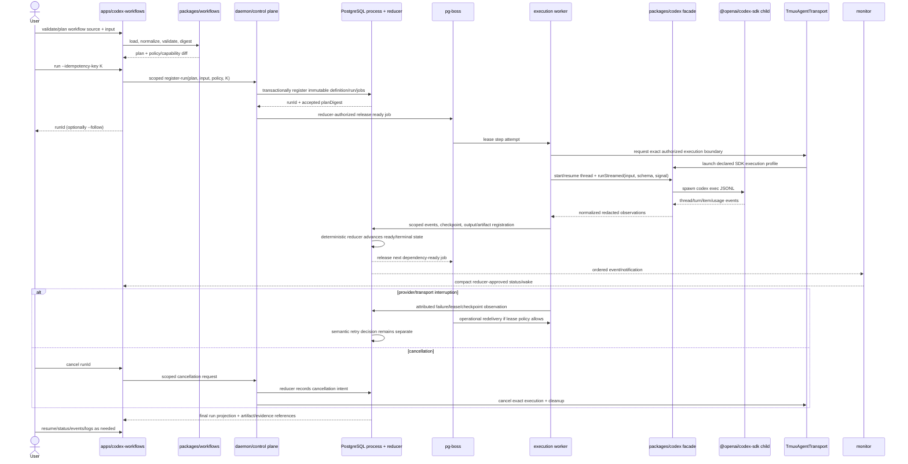

# Codex Workflows SDK Architecture Report

**Repository:** `/Users/mcasa_atlantis/.codex/orchestration`  
**Research date:** 2026-08-07  
**Requested runtime target:** `gpt-5.6-luna` (a campaign/profile decision, not an authority grant)  
**Status of this artifact:** Architecture report; no product implementation or scaffold performed.

## 1. Executive recommendation and verdict

### Recommendation

Proceed with the requested shape, with two hard boundary amendments:

1. `packages/workflows` is a pure, serializable workflow-definition, normalization, validation, and planning library. It must not own Codex SDK clients, PostgreSQL, pg-boss, tmux, credentials, reducer transitions, or retry policy.
2. `apps/codex-workflows` is a CLI/composition root, not a second orchestration daemon. Its durable `run`, `resume`, `status`, `events`, and `cancel` paths submit scoped commands to the existing daemon/control plane and read reducer-approved projections. Its local `validate`, `inspect`, `plan`, and `dry-run` paths may be client-side and read-only. It must not launch a second tmux transport, consume pg-boss as a second retry authority, or reduce process state locally.

`packages/codex` is the only repository-owned import boundary for `@openai/codex-sdk`. It exposes a typed, policy-neutral facade and a process-level singleton client initialized exactly once per host process. The singleton owns only the SDK executable/client configuration and lifecycle bookkeeping. Workflow definitions, workflow runs, thread IDs, policies, credentials for individual tasks, and durable state remain outside that singleton.

The implementation should add the requested names as a pure package plus a thin CLI, while keeping the long-lived daemon as the owner of delivery, leases, reconciliation, monitor wake, and execution workers. A future `packages/workflow-runtime` should not be created at the outset; if runtime code outgrows the composition root, that is a later founder decision backed by feature evidence rather than a speculative god-package.

### Explicit verdict: GO, conditional on the boundary rulings

**GO** for an implementation campaign that first ratifies contracts and then builds a vertical slice through `validate → plan → durable run → stream/observe → resume → final artifact`. **NO-GO** for any design that:

- lets `packages/workflows` construct a `Codex` client or decide semantic retries;
- imports `@openai/codex-sdk` from an app, daemon, workflow package, test fixture outside a narrow adapter, or another production package;
- makes the CLI own a reducer, direct pg-boss worker, or alternate tmux implementation;
- treats Codex thread/session persistence, terminal completion, a final response, or a Markdown report as acceptance;
- executes model-authored arbitrary TypeScript without trust, compilation, path, capability, and approval controls;
- silently replaces `.pi/` state without a compatibility window and rollback path.

This is an architecture recommendation, not acceptance evidence. It must be lowered into feature contracts, executable scenarios, immutable assignments, and independent proof under the repository's BATDD and orchestration law.

## 2. Current repository architecture and authority map

### Verified repository facts

The root `README.md` describes an event-driven, BATDD-governed Codex orchestration workspace. `PRD.md` and `ROADMAP.md` state that the generated `apps/daemon` scaffold is not architecture, while the accepted domains remain documentation-only until deliberately generated as independent Nx projects. At the time of this report, `bun nx show projects --json` returns only:

- `@orchestration/testing`;
- `@orchestration/daemon-e2e`;
- `@orchestration/daemon`.

The current daemon is a scaffold whose source exports and prints `Hello World`; its tests prove only that scaffold boundary. `packages/testing` is the only implemented library project and owns the Ground-0 aggregate/policy harness. The package roots for `auth`, `boundary`, `codex`, `db`, `delivery`, `monitor`, `process`, `shared`, and `transport` have accepted `FEATURES.md` catalogs but no product source or local README. `packages/testing/README.md` is the only package-level README currently present.

The repository's accepted domain catalogs define the following authority map:

| Authority | Owns | Explicitly does not own |
|---|---|---|
| `shared` | Branded neutral values, deterministic serialization/digests, time, results, safe diagnostics | Domain policy, infrastructure, miscellaneous utilities |
| `boundary` | Stable source-attributed errors, causes, redacted serialization | Retry, repair, verdict, acceptance |
| `auth` | Roles, capabilities, assignment/execution binding, scoped authorization | CLI parsing, persistence, transport launch, reducer transitions |
| `process` | Immutable campaign/DAG/attempt contracts, events, reducer, replay, readiness, evidence/verdict rules | SQL, pg-boss timing, tmux, hooks, interface presentation |
| `db` | PostgreSQL schema/migrations/roles/persistence ports and pg-boss storage bridge | Reducer legality, queue semantics, transport, acceptance |
| `delivery` | pg-boss scheduling, claims, leases, heartbeats, reaping, delivery retry and recovery | Semantic repair, DAG legality, acceptance |
| `monitor` | Durable declarative waits, cursors, aggregation, reconciliation, compact wakes | State transitions, arbitrary SQL/code, retry, verdict interpretation |
| `codex` | Codex runtime identity, SDK/CLI launch profile, hook/lifecycle normalization | tmux, worktrees, assignment legality, process transitions, verdicts |
| `transport` | The versioned `AgentTransport`/`TmuxAgentTransport` boundary, direct tmux, worktrees, routing, cleanup | Jobs, queue timing, evidence, monitor conditions, acceptance |
| `testing` | Nx-owned L1/L2/L3 and real-boundary acceptance infrastructure | Product runtime authority |

The authority order is explicit: human rulings/repository law, accepted product and feature contracts, immutable campaign/assignment envelopes, executable tests and bindings, reducer-approved state, skills and prompts, then self-report. The Agent Wiki SPEC names PostgreSQL `process` data as durable truth, the deterministic reducer as the only state-transition authority, pg-boss as delivery/lease/retry authority, and direct orchestration-owned tmux as the canonical physical transport. The SPEC and linked standards were read through the headless `wiki` CLI; no Wiki note was modified.

### Existing workflow-adjacent surface

The untracked `.pi/` directory is preserved and was inspected read-only. It currently contains:

- `.pi/goals/archived/goal_2026071612024695_mrn48esr-mggbiz.md`, an archived v3 goal object with objective, status, task list, evidence strings, and completion/audit metadata;
- `.pi/goals/goal_events.jsonl`, an append-only event projection for creation, resume, task completion, audit, and goal completion.

No TypeScript workflow definitions or `.pi` runtime implementation files are present in the inspected tree. Therefore the migration target is not a mature workflow engine; it is a small goal/task/event compatibility surface whose concepts must be mapped deliberately. The report does not edit, move, or delete `.pi/`.

### Authority consequence for this proposal

The requested workflow graph is an input contract and a plan snapshot. It is not a second state machine. A normalized workflow definition can describe nodes, dependencies, branches, joins, subworkflows, artifacts, and policy declarations. The `process` domain must translate that plan into immutable jobs/attempts and reduce execution events. The workflow package may reject an invalid graph before submission; it must not independently advance a durable run from `running` to `accepted`.

## 3. Official Codex SDK capability inventory and constraints

### Verified external facts

The current official Codex SDK documentation says the TypeScript library is server-side, requires Node.js 18+, and supports starting, continuing, and resuming local Codex threads. It documents `new Codex()`, `startThread()`, `thread.run()`, repeated `run()` calls on a thread, and `resumeThread(threadId)`. The official OpenAI Codex repository's TypeScript SDK README states that the SDK wraps the `codex` CLI, spawns it, and exchanges JSONL events over stdin/stdout.

The official TypeScript source currently exposes these concepts:

| Surface | Verified capability | Architectural implication |
|---|---|---|
| Client | `new Codex(options)` | One process-level construction seam is feasible and desirable. |
| Threads | `startThread(options)` and `resumeThread(id, options)` | Persist the Codex thread ID as an execution observation; it is not the process job identity. |
| Turns | `thread.run(input, turnOptions)` | Buffered completion is suitable for simple steps, but the caller must persist start/completion/failure observations. |
| Streaming | `thread.runStreamed(input, turnOptions)` returns an async generator of `ThreadEvent` values | Stream events into bounded diagnostics and durable event ingestion; do not rely on stream delivery for truth. |
| Input | String or text/local-image entries | Workflow inputs should be normalized before being turned into prompts; paths need policy validation. |
| Structured output | Per-turn JSON Schema through `outputSchema` | Use for bounded agent outputs and workflow-authored drafts, followed by independent schema validation. |
| Thread options | `model`, `sandboxMode`, `workingDirectory`, `skipGitRepoCheck`, `modelReasoningEffort`, `networkAccessEnabled`, `webSearchMode`, legacy web-search flag, `approvalPolicy`, and `additionalDirectories` | These are per-thread/per-turn execution controls and must be frozen into the assignment/profile, not selected by model prose. |
| Client options | `codexPathOverride`, `baseUrl`, `apiKey`, `config`, and `env` | Host configuration belongs to `packages/codex`; secrets must be injected through a scoped process configuration path. |
| Cancellation | `TurnOptions.signal` is forwarded to the child process spawn | Cancellation must be wired to an authorized process operation and recorded as a fact; cancellation is not semantic failure by itself. |
| Native runtime | The SDK locates a platform package for the bundled Codex executable, unless overridden | Build and deployment must pin the package/runtime and test optional dependency resolution. |

The SDK source currently uses `codex exec --experimental-json`, passes `--config` overrides, can use `resume <threadId>`, and reads JSONL lines from the child process. The TypeScript SDK's `Codex` class does not expose a close/shutdown method; its primary object is a client around executable resolution and options. There is no documented TypeScript SDK method in the inspected official sources for registering an `mcpServers` object, spawning Codex subagents, or managing a durable workflow graph. The TypeScript source does expose generic `config` overrides, but a workflow implementation must not assume that a named CLI config key is stable or that it constitutes a typed MCP registration API. If MCP is required by a workflow, the campaign profile must pin and validate the installed Codex CLI/config behavior or route the external tool through an existing repository-owned MCP/service boundary.

OpenAI's SDK page explicitly says to use the Codex SDK for coding-focused Codex threads and, when Codex is one specialist inside a broader orchestrated workflow, points to running Codex CLI as an MCP server and orchestrating it with the Agents SDK. That is a useful capability boundary: this repository's durable orchestrator should remain the outer control plane, and the TypeScript SDK should be treated as a local coding-agent execution adapter.

### Constraints and non-claims

The report does not claim that the TypeScript SDK itself provides durable PostgreSQL state, pg-boss semantics, workflow-level retries, cross-host resume, a cancellation callback beyond the abort signal, MCP server registration, or an external event sink. Those are repository responsibilities. The SDK's persisted `~/.codex/sessions` directory is useful for local thread resume but is not sufficient for campaign recovery, audit, authority, or acceptance. A process crash may leave a Codex session, a partial filesystem change, or neither; reconciliation must treat each as an observation and compare it with the durable execution envelope.

## 4. **Claude Code dynamic workflows** comparison

The canonical research-pinning term for this comparison is exactly **Claude Code dynamic workflows**. Official Claude Code documentation describes dynamic workflows as JavaScript scripts written for a task and executed by a runtime that orchestrates many subagents. The documented model is deliberately relevant to this proposal: the script holds the plan, branching, fan-out, joins, and intermediate variables rather than relying on the parent conversation to coordinate every turn. Official examples include per-file audits with verification, repeat-until-check-passes loops, parallel migrations in isolated copies, cross-checked research, and a final synthesis.

### Capability/design matrix

| Capability | Observed in official Claude Code documentation | Codex/repository design decision |
|---|---|---|
| Programmatic workflow | A runtime executes a JavaScript orchestration script in the background; `agent()` and `pipeline()` express fan-out and aggregation | Adopt typed TypeScript workflow objects and a deterministic planner, but compile them into repository process jobs rather than an in-memory script-only runtime. |
| Dynamic authoring | Claude can write a workflow from a task and the user can inspect/approve or save it | Allow Codex to author a structured `WorkflowDraft` JSON/TS representation, but require schema validation, policy admission, digesting, and explicit approval before durable execution. |
| Repeatability | Saved `.claude/workflows/` scripts can be reused as commands | Store a content-addressed normalized workflow definition and source provenance; do not let mutable source edits change an in-flight run. |
| Parallelism | `pipeline()` runs an agent per item; documented limits include up to 16 concurrent agents and 1,000 total agents per run | Use process DAG dependencies, capacity, leases, and write surfaces. Any concurrency cap is a policy/profile value, not a workflow-local retry loop. |
| Intermediate state | Script variables hold results and the parent context receives the final report | Persist step outputs/artifacts/checkpoints through `process`; memory variables are only a local optimization and never authoritative. |
| Resume | A paused run can resume in the same Claude Code session; completed agents may be cached while later work restarts according to documented ordering | Durable resume must survive CLI/daemon/host restart and use idempotent process events and checkpointed step identity. SDK thread resume is only one input to that reconciliation. |
| Observability | `/workflows` shows phases, agent counts, token totals, elapsed time, and drill-down results | Provide `status`, `events`, and `logs` projections backed by immutable process events and artifact references. |
| Structured result | Claude headless/Agent SDK offers structured output and streaming message objects | Use Codex `outputSchema` for bounded step results, but independently validate JSON and preserve raw/diagnostic data only under redaction limits. |
| Permissions | Claude documents tool allowlists, permission modes, bare mode, hooks, and sandbox behavior | Use Codex's declared sandbox/approval/model/effort options and repository `auth` capabilities; never infer authority from a prompt or model. |
| Filesystem/code execution | Official dynamic workflows run in an isolated environment, have no direct filesystem/shell access from the workflow script, do not support module loading, and agents perform the operations | Default to a declarative, registered-step workflow AST. Trusted local TypeScript may be compiled in a controlled loader, but model-authored code must not receive ambient imports, credentials, or unrestricted filesystem access. |
| Agent teams | Claude distinguishes ephemeral subagents from agent teams with shared tasks/direct messaging, and notes agent teams are not directly configured via SDK options | Do not emulate a second peer-agent mesh. The existing durable DAG and direct tmux transport are the team substrate; any Codex child is a bounded execution, not a new durable authority tree. |

The comparison supports the user-experience goal—author, inspect, run, observe, resume, and reuse workflows—but it does not establish that Codex exposes the same runtime primitives. “Comparable in spirit” should mean a readable programmatic definition and good plan/observe/retry ergonomics, not feature parity or a claim that Codex supports Claude's `agent()`/`pipeline()` API.

## 5. Proposed domain and Nx project topology

### Project topology

Add these independently registered Nx projects after feature contracts and generators are authorized:

```text
packages/workflows/         @orchestration/workflows       library
packages/codex/             @orchestration/codex           library (existing catalog; SDK owner)
apps/codex-workflows/       @orchestration/codex-workflows application/CLI
apps/codex-workflows-e2e/   @orchestration/codex-workflows-e2e optional L2/L3 boundary app
```

`packages/workflows` is a new capability package, but it is not a new durable authority domain. It is a pure planning/definition library that consumes `shared` and `boundary`. It may use `process` types only through narrow, dependency-inverted plan adapters if the final domain graph proves that necessary; the safer V1 choice is to define workflow-neutral plan contracts in `workflows` and let `process` own the translation to durable jobs. It must never depend on `db`, `delivery`, `monitor`, `transport`, or `testing`.

`packages/codex` remains the SDK boundary described by `DOMAINS.md` and its `CDX-*` features. It may depend on `shared`, `boundary`, `auth`, and `process` contracts. It must not depend on `transport` or database adapters. The Codex package owns the direct third-party import and maps Codex-specific events/options/errors into repository-neutral contracts.

`apps/codex-workflows` may depend on `workflows`, `codex`, and the public process/control-plane interfaces exposed by the eventual daemon service. It may consume `transport` only through a public orchestration operation if the composition contract requires it; it must not call tmux primitives. It may depend on `monitor` through a client/projection boundary, not through monitor internals. It may use `boundary` for CLI error views and `shared` for IDs/digests. It must not be imported by any production package.

The daemon should eventually compose `process`, `db`, `delivery`, `monitor`, `codex`, and `transport` through the existing direction. The daemon and CLI may both import `@orchestration/codex`; they must not share a mutable thread registry, workflow registry, policy singleton, or credential global.

### Forbidden edges and import rule

Enforce these rules in Nx tags and a static import policy:

- `@openai/codex-sdk` imports are forbidden outside `packages/codex/**`, except a narrowly justified package-level adapter test that imports a type or fake boundary and is excluded from production compilation. Prefer no direct third-party import in tests at all.
- `workflows → codex`, `workflows → process`, `workflows → db`, `workflows → delivery`, `workflows → monitor`, and `workflows → transport` are forbidden in the initial design.
- `codex → transport`, `codex → db`, `codex → delivery`, and `codex → monitor` are forbidden.
- `transport → workflows` and `process → workflows` are forbidden unless a later founder ruling adds a dependency-inverted neutral schema package; no cycle is acceptable.
- `testing` remains downstream-only and cannot be a production dependency.
- `apps/codex-workflows` cannot import database clients, pg-boss internals, tmux command wrappers, reducer implementation modules, or private SDK internals.

If the pure plan contracts need to be shared by `process` and `workflows`, use a small, domain-neutral contract area in `shared` only after proving at least two consumers and no policy leakage. Do not respond by adding a miscellaneous `shared` bag.

### Boundary judgment

The exact requested names are valid if the package responsibilities above are enforced. `packages/workflows` becomes a god package only if it accumulates policy, persistence, runtime, and provider code. `apps/codex-workflows` overlaps the daemon only if it directly manages long-lived workers or physical resources. The proposed boundary keeps it as a product-facing composition root, comparable to a CLI adapter in `DOMAINS.md`, while the daemon remains the one long-lived control-plane host.

## 6. TypeScript authoring API

The API below is intentionally declarative. It is compilable-looking TypeScript, not an implementation claim about files that exist today. The concrete implementation should use a schema library already ratified by the repository or a narrow package-local schema adapter; the example uses `zod` notation only to make input/output types explicit.

```ts
import { z } from 'zod';
import {
  defineWorkflow,
  step,
  parallel,
  subworkflow,
  artifact,
  policy,
  type WorkflowContext,
} from '@orchestration/workflows';

const input = z.object({
  repository: z.string().regex(/^[-a-z0-9._/]+$/),
  files: z.array(z.string()).min(1),
  objective: z.string().min(1),
});

const findings = z.object({
  file: z.string(),
  severity: z.enum(['info', 'warning', 'error']),
  message: z.string(),
});

export const securityReview = defineWorkflow({
  id: 'security-review',
  version: 1,
  description: 'Review selected files and produce a verified finding set.',
  input,
  output: z.object({
    findings: z.array(findings),
    reportArtifact: z.string(),
  }),
  policy: policy({
    maxConcurrentSteps: 4,
    maxAttempts: 2,
    sandbox: 'read-only',
    approval: 'on-request',
    allowedRoots: ['workspace'],
    network: 'disabled',
    allowedModels: ['gpt-5.6-luna', 'gpt-5.6-terra'],
  }),
  steps: [
    step({
      id: 'plan',
      output: z.object({ files: z.array(z.string()) }),
      run: async (ctx: WorkflowContext<typeof input, never>) => ({
        files: ctx.input.files,
      }),
    }),
    parallel({
      id: 'review-files',
      over: 'plan.files',
      dependsOn: ['plan'],
      concurrency: 4,
      output: findings,
      run: async (ctx) => ctx.codex.structured({
        prompt: `Review ${ctx.item} for security defects. Return only the schema result.`,
        schema: findings,
        sandbox: 'read-only',
      }),
    }),
    step({
      id: 'verify',
      dependsOn: ['review-files'],
      input: z.object({ findings: z.array(findings) }),
      output: z.object({ findings: z.array(findings) }),
      when: (ctx) => ctx.outputs['review-files'].length > 0,
      run: async (ctx) => ctx.codex.structured({
        prompt: 'Adversarially verify the proposed findings; do not edit files.',
        input: { findings: ctx.outputs['review-files'] },
        schema: z.object({ findings: z.array(findings) }),
        sandbox: 'read-only',
      }),
    }),
    subworkflow({
      id: 'report',
      dependsOn: ['verify'],
      workflow: () => reportWorkflow,
      mapInput: (ctx) => ({ findings: ctx.outputs.verify.findings }),
    }),
    artifact({
      id: 'report-artifact',
      dependsOn: ['report'],
      kind: 'workflow.report.json',
      from: (ctx) => ctx.outputs.report,
      immutable: true,
    }),
  ],
});
```

The public API should impose these invariants at compile/validate time:

- every step ID is unique and stable;
- every dependency exists and the graph is acyclic;
- output references point to declared upstream outputs;
- conditional branches have an explicit join policy (`all`, `any`, or `otherwise`), not an implicit “missing means success” rule;
- fan-out has a declared item source, concurrency cap, ordering/key function, and join semantics;
- subworkflow input/output schemas are compatible and the child definition digest is included in the parent plan;
- artifact producers declare type, size/redaction policy, immutability, and retention class;
- policy fields are constraints to be checked against campaign/assignment policy, not permissions granted by the workflow author;
- a `run` handler is either a registered trusted step implementation or a Codex facade call with a declared schema and policy; arbitrary closures cannot cross a durable serialization boundary.

### Model-authored workflow drafts

Codex should author a `WorkflowDraft` using a strict output schema, not directly write and execute arbitrary JavaScript in the first version:

```ts
const draftSchema = {
  type: 'object',
  additionalProperties: false,
  required: ['id', 'steps', 'output'],
  properties: {
    id: { type: 'string', pattern: '^[a-z0-9][a-z0-9._-]*$' },
    steps: { type: 'array', items: { $ref: '#/$defs/step' } },
    output: { type: 'object' },
  },
  $defs: {
    step: {
      type: 'object',
      additionalProperties: false,
      required: ['id', 'kind', 'dependsOn', 'prompt', 'outputSchema'],
      properties: {
        id: { type: 'string' },
        kind: { enum: ['codex.turn', 'registered.transform', 'join'] },
        dependsOn: { type: 'array', items: { type: 'string' } },
        prompt: { type: 'string', maxLength: 20000 },
        outputSchema: { type: 'object' },
      },
    },
  },
} as const;

const turn = await codexFacade.structured({
  prompt: 'Author a workflow draft for the user objective. Use only allowed step kinds.',
  schema: draftSchema,
  sandbox: 'read-only',
});
const plan = validateAndNormalizeDraft(turn.value);
```

The CLI must show the normalized plan and policy diff before a durable `run`. A future trusted authoring mode may emit a `.ts` module, but the module must be content-addressed, compiled in an isolated temp workspace, imported from an allowlisted root, and reduced to the same serializable AST before execution. The runtime never treats TypeScript source itself as durable state.

## 7. Runtime execution model and `packages/codex` singleton

### Lifecycle and state separation

There are four distinct identities:

1. **Process-level SDK client:** one `Codex` instance and immutable host options per daemon/CLI process. It owns executable resolution and default SDK environment/config, not work.
2. **Workflow run:** a durable `process` identity containing the normalized workflow definition digest, input digest, policy snapshot, plan, and execution graph.
3. **Step attempt/execution:** a durable job/attempt/execution identity with role, write lease, model/sandbox/approval policy, working directory, and retry budget.
4. **Codex thread/turn:** provider/runtime observations associated with a step execution. A thread may be resumed for a continuation, but the workflow run remains authoritative.

The singleton must not store a `Map<workflowId, Thread>`, current policy, current inputs, mutable output cache, event subscribers, or credentials selected by a step. The worker reconstructs a thread from a persisted thread ID through the facade for the one step execution it is servicing. Different workflow steps may use separate threads or explicit same-thread continuation according to the frozen plan. A single thread must not be run concurrently; the worker scheduler enforces that invariant.

### Proposed `packages/codex` facade and singleton

Proposed files:

```text
packages/codex/src/sdk/codex-sdk-singleton.ts
packages/codex/src/sdk/codex-facade.ts
packages/codex/src/sdk/codex-types.ts
packages/codex/src/sdk/codex-config.ts
packages/codex/src/hooks/*
packages/codex/src/index.ts
```

The following is a concrete, compilable-looking shape. It deliberately uses only the public SDK surface and keeps the singleton lifecycle explicit:

```ts
// packages/codex/src/sdk/codex-sdk-singleton.ts
import { createHash } from 'node:crypto';
import { Codex } from '@openai/codex-sdk';
import type { CodexOptions } from '@openai/codex-sdk';

export type CodexHostOptions = Readonly<CodexOptions> & {
  readonly configVersion: number;
};

export type CodexSdkHandle = Readonly<{
  readonly client: Codex;
  readonly fingerprint: string;
  readonly initializedAt: string;
  readonly acquire: () => () => void;
}>;

type State = {
  handle: CodexSdkHandle;
  activeOperations: number;
  closing: Promise<void> | undefined;
};

let state: State | undefined;

function stableConfig(options: CodexHostOptions): string {
  // Never include apiKey in a fingerprint or diagnostic. The caller must provide
  // a stable secret source; only non-secret configuration is fingerprinted.
  return JSON.stringify({
    configVersion: options.configVersion,
    codexPathOverride: options.codexPathOverride ?? null,
    baseUrl: options.baseUrl ?? null,
    config: options.config ?? null,
    envKeys: Object.keys(options.env ?? {}).sort(),
  });
}

function freezeHostOptions(options: CodexHostOptions): CodexHostOptions {
  return Object.freeze({
    ...options,
    config: options.config ? Object.freeze({ ...options.config }) : undefined,
    env: options.env ? Object.freeze({ ...options.env }) : undefined,
  });
}

export function initializeCodexSdk(options: CodexHostOptions): CodexSdkHandle {
  const frozen = freezeHostOptions(options);
  const fingerprint = createHash('sha256')
    .update(stableConfig(frozen))
    .digest('hex');

  if (state) {
    if (state.handle.fingerprint !== fingerprint) {
      throw new Error('Codex SDK already initialized with a different host configuration');
    }
    return state.handle;
  }

  const client = new Codex(frozen);
  const handle: CodexSdkHandle = Object.freeze({
    client,
    fingerprint,
    initializedAt: new Date().toISOString(),
    acquire: () => {
      if (!state || state.handle !== handle || state.closing) {
        throw new Error('Codex SDK is not accepting new operations');
      }
      const owner = state;
      owner.activeOperations += 1;
      let released = false;
      return () => {
        if (!released) {
          released = true;
          owner.activeOperations -= 1;
        }
      };
    },
  });
  state = { handle, activeOperations: 0, closing: undefined };
  return handle;
}

export function getCodexSdk(): CodexSdkHandle {
  if (!state) throw new Error('Codex SDK has not been initialized');
  return state.handle;
}

export async function shutdownCodexSdk(): Promise<void> {
  if (!state) return;
  if (state.closing) return state.closing;
  const owner = state;
  owner.closing = (async () => {
    while (owner.activeOperations) await new Promise((r) => setImmediate(r));
    // @openai/codex-sdk currently exposes no close() method. Shutdown therefore
    // stops new work, waits for child operations, and drops the host reference.
    state = undefined;
  })();
  return owner.closing;
}

/** Test-only seam; production code must use shutdownCodexSdk(). */
export function resetCodexSdkForTests(): void {
  if (state?.activeOperations) throw new Error('cannot reset Codex SDK with active operations');
  state = undefined;
}
```

The production facade should wrap `startThread`, `resumeThread`, `run`, and `runStreamed` so callers do not import SDK types or construct clients:

```ts
// packages/codex/src/sdk/codex-facade.ts
import { getCodexSdk } from './codex-sdk-singleton.js';

type Thread = ReturnType<ReturnType<typeof getCodexSdk>['client']['startThread']>;

export type CodexTurnRequest = {
  input: Parameters<Thread['run']>[0];
  threadId?: string;
  thread?: Parameters<ReturnType<typeof getCodexSdk>['client']['startThread']>[0];
  turn?: Parameters<Thread['run']>[1];
};

export async function runCodexTurn(request: CodexTurnRequest) {
  const sdk = getCodexSdk();
  const release = sdk.acquire();
  try {
    const thread = request.threadId
      ? sdk.client.resumeThread(request.threadId, request.thread)
      : sdk.client.startThread(request.thread);
    const result = await thread.run(request.input, request.turn);
    return { threadId: thread.id, result };
  } finally {
    release();
  }
}

export async function streamCodexTurn(request: CodexTurnRequest) {
  const sdk = getCodexSdk();
  const release = sdk.acquire();
  const thread = request.threadId
    ? sdk.client.resumeThread(request.threadId, request.thread)
    : sdk.client.startThread(request.thread);
  const streamed = await thread.runStreamed(request.input, request.turn);
  return {
    threadId: () => thread.id,
    events: streamed.events,
    release, // the event consumer must release in a finally block
  };
}
```

The illustrative facade should be tightened during implementation so `release` is impossible to forget—for example by exposing an async generator that releases in `finally`. The key contract is ownership, not this exact helper shape. A real implementation should also use a per-thread mutex or scheduler admission so two turns cannot race on one thread, apply operation deadlines around the async generator, normalize SDK/child-process failures into `boundary` codes, and emit redacted lifecycle events.

### Configuration and policy

Host initialization reads one explicit, validated configuration at process startup: executable/package version, non-secret environment allowlist, optional base URL, CLI config overrides, and a credential provider result. The daemon and CLI each initialize their own process-local singleton. They do not share the singleton across processes and do not share thread state. Workflow policy is an immutable snapshot in the run/assignment and is translated into SDK thread/turn options by the worker. An SDK client default cannot weaken an assignment policy; the worker intersects requested settings with the authorized profile and rejects an invalid request before spawn.

For the current SDK's verified controls, map:

- `model` and `modelReasoningEffort` from the immutable campaign profile/step policy;
- `sandboxMode`, `networkAccessEnabled`, `additionalDirectories`, and `workingDirectory` from the authorized execution envelope;
- `approvalPolicy` from an explicit role/profile setting; never default silently to a more permissive mode;
- `webSearchMode` only if the workflow profile permits it and the installed CLI capability is pinned;
- `outputSchema` for machine-readable result steps;
- `TurnOptions.signal` from the cancellation/deadline controller.

MCP is a declared capability gap in the TypeScript SDK surface. The first implementation should either use a prevalidated Codex CLI configuration profile or expose repository tools through the existing orchestration service/MCP surface. It must not pretend that arbitrary model-authored MCP configuration is safe.

## 8. Durable-state integration

### Single state machine

At `run`, the CLI submits:

1. workflow definition digest and normalized plan;
2. input digest and redacted input summary;
3. requested workspace(s) and repository revision(s);
4. policy/profile snapshot and capability requirements;
5. idempotency key and actor/capability identity.

The daemon validates the plan against process policy, stores an immutable campaign/run definition, creates jobs for executable nodes, and releases only dependency-ready jobs through reducer-authorized delivery. Every node maps to a durable job/attempt/execution. Branch and join nodes are represented as process dependencies and reducer-approved logical conditions, not as a private interpreter state.

### Event and checkpoint contract

Recommended events include:

```text
workflow.definition_registered
workflow.plan_validated
workflow.run_requested
workflow.run_started
workflow.step_ready
workflow.step_dispatched
workflow.step_execution_started
workflow.codex_thread_bound
workflow.turn_started
workflow.turn_event_observed
workflow.step_checkpointed
workflow.step_output_registered
workflow.artifact_registered
workflow.step_succeeded
workflow.step_failed
workflow.step_cancelled
workflow.run_blocked
workflow.run_completed
workflow.run_cancelled
workflow.run_failed
```

These are facts/claims submitted through scoped clients. The deterministic reducer validates causality, assignment, sequence, idempotency, evidence, and dependency transitions. `workflow.run_completed` means all required nodes have terminal execution outcomes according to the declared plan; it does not mean the business objective is accepted. If the workflow has a verification or Judge step, that step's verdict remains separate.

Checkpoints contain step ID, attempt ID, thread ID (if any), current cursor/sequence, output artifact IDs, input/output digests, and the policy/plan revision. A restart first reconciles delivery and physical execution resources, then resumes only from a reducer-approved checkpoint. A thread ID without a matching execution identity is quarantined, never adopted automatically.

### Delivery, retry, lease, and monitor boundaries

- PostgreSQL `process` is authoritative for the workflow run, DAG, event sequence, artifact/evidence registration, and reducer state.
- pg-boss owns delivery timing, claims, leases, heartbeats, reaping, redelivery, and recovery. A queue redelivery must not consume a semantic repair budget.
- Semantic step retry is a reducer/process decision based on the immutable workflow policy, failed scope, evidence, and retry budget. It is not a `catch` loop in `packages/workflows` or the CLI.
- `monitor` subscribes to declarative projections such as “all frozen members of this run are terminal” or “step X is ready for a successor attempt.” It uses query-arm-requery and durable cursors; it does not poll prompts or inspect pane text as truth.
- `transport` remains the only physical tmux/worktree adapter. A Codex SDK child process may be launched within the transport's declared execution boundary, but the workflow runner must not add a second tmux path.
- The daemon's existing service/Unix-socket/MCP boundary, once selected by the composition campaign, is the only path for the CLI to submit commands and observe durable projections.

This design preserves the repository's core distinction: the workflow definition describes what may be executed; the process state machine records what has happened and what is legally next.

## 9. CLI UX and command contract

Binary name: `codex-workflows`. Output is human-readable by default and stable JSON with `--json`. Every command accepts `--cwd`/workspace selection only within a validated path policy, and every durable mutation accepts `--idempotency-key` or derives one from a command digest plus explicit invocation identity.

| Command | Read/write | Contract |
|---|---|---|
| `validate <source>` | Read-only | Load a named workflow/module or draft, validate schema/graph/policies/paths, print warnings/errors, and return nonzero on any admission failure. No SDK run, DB mutation, or child process. |
| `inspect <source>` | Read-only | Show source provenance, normalized definition, schema versions, dependencies, policy requests, and digest. Redact prompts/secrets by default. |
| `plan <source> [--input]` | Read-only by default | Compile to a deterministic plan with step IDs, dependency edges, fan-out cardinality, joins, policy intersection, estimated resource/cost fields, and required capabilities. `--submit` is a separate explicit action. |
| `run <source> [--input]` | Durable submit | Register the immutable plan/input/policy snapshot through the control plane, return `runId`, and optionally `--follow` the monitor projection. No local runner authority. |
| `resume <run-id>` | Durable submit | Request reducer-authorized continuation/recovery for a blocked or interrupted run, optionally with an approved input/policy amendment ID. Never mutate the original plan in place. |
| `status <run-id>` | Read-only | Read a compact reducer-approved run/step/attempt projection; include current terminal/blocked reason, checkpoint IDs, and next legal operation. |
| `events <run-id>` / `logs <run-id>` | Read-only | Stream bounded event/artifact projections with `--since`, `--follow`, `--json`; logs are diagnostic and redacted, events retain stable IDs and causal references. |
| `cancel <run-id>` | Durable submit | Request cancellation with actor identity/reason; the reducer and transport target exact executions, record cleanup outcomes, and distinguish cancelled from failed. |
| `dry-run <source> [--input]` | Read-only | Equivalent to validate + plan + policy/resource checks, with no SDK spawn, no database write, no queue release, no file mutation, and no thread/session creation. |

`run` should default to returning after durable registration, not block a terminal for the full run. `--follow` is an operator convenience over the monitor; it must be restart-safe and may reconnect using `runId`. The CLI must never turn a successful HTTP/socket response, process exit, or final response into acceptance.

## 10. Workflow discovery, loading, and security model

### Trust classes

Classify sources before loading:

- **Built-in/installed trusted:** versioned package exports and repository-owned registered steps.
- **Repository trusted:** local `.ts`/`.js` workflow modules under an allowlisted root, after review and compilation; still subject to policy and path checks.
- **Model-authored draft:** structured JSON/AST from Codex output; never executed as source until explicitly promoted to a trusted module.
- **Untrusted external:** network/downloaded/archive/symlinked source; reject in V1 unless a separate signed package policy is ratified.

### Loading pipeline

1. Resolve a logical workflow name to an allowlisted root; reject path traversal, absolute paths outside roots, symlink escape, duplicate IDs, and package self-modification during load.
2. Read source and package-lock/lockfile provenance; compute source and dependency digests.
3. Compile with a pinned TypeScript/esbuild toolchain into a temp output directory outside product write surfaces. Do not use `eval` or `new Function`.
4. Load only an entrypoint export with a constrained module allowlist. A first version should allow `@orchestration/workflows`, `@orchestration/shared`, and approved schema/runtime-neutral dependencies; deny `node:child_process`, arbitrary network clients, database drivers, tmux wrappers, and secret stores to workflow-definition code.
5. Reduce the result to a serializable normalized definition. Functions become registered handler IDs; closures, open file descriptors, sockets, client instances, and non-serializable values are rejected.
6. Validate schemas, graph, policy, artifact limits, capability requirements, and path policy. Store the normalized plan digest, not a mutable module reference.
7. For a model-authored draft, show the plan and policy diff; require the declared approval boundary before `run`.

### Credentials and execution risk

Secrets are process/assignment inputs, never workflow data or prompt text by default. The Codex child receives only an explicit environment allowlist and scoped credentials required by the assignment. Prompts, tool arguments, streamed content, and output artifacts are bounded and redacted before events/logs. The runner must prevent a workflow from requesting `danger-full-access`, network access, extra directories, or a model outside policy merely by declaring it. Policy intersection is monotonic toward less privilege.

TypeScript workflow modules are code execution. Even a valid typecheck is not a security proof. The implementation campaign must decide whether repository-trusted modules run in the same process as the CLI or in an isolated loader/worker. The safe default is a separate compilation/validation process and a separate execution worker with an explicit capability bridge. The report recommends declarative drafts and registered transforms as the V1 path, with arbitrary trusted code deferred until the security/hosting boundary is proven.

## 11. Observability and artifact model

Every object needs stable IDs and digests:

```text
workflowDefinitionId + definitionDigest
workflowRunId + planDigest + inputDigest
stepId + stepAttemptId + executionId
transportIncarnationId + codexThreadId + codexTurnId
eventId + causationId + correlationId + sequence
artifactId + contentDigest + schemaVersion
```

The event envelope carries source package, event type/version, actor/role, scope, causation, correlation, occurred/recorded times, safe payload, and idempotency key. It must not contain full prompt/tool payloads or secrets. Raw SDK event details are retained only when the profile declares a bounded redacted diagnostic artifact; the canonical event stream stores normalized lifecycle facts.

Record:

- requested/effective model and reasoning effort;
- requested/effective sandbox, approval, network, working directory, and additional directories;
- SDK/package/runtime version and config fingerprint;
- thread/turn IDs and whether a turn was new, continued, or resumed;
- start/end/duration, cancellation/deadline cause, child exit/signal, and provider/transport classification;
- SDK usage fields when `turn.completed` provides them, with explicit “unknown” rather than invented cost;
- final response as a bounded diagnostic/result projection, never as evidence by itself;
- schema-validated structured result and content digest;
- artifacts for plan, inputs, outputs, logs, command results, checkpoints, and cleanup/resource inventory;
- immutable evidence links used by Preflight/Verifier/Judge.

Human-readable reports are generated projections. Immutable registered artifacts and reducer-approved state are proof. This follows the repository SPEC's rule that authored Markdown is architecture/decision rationale, not acceptance evidence.

## 12. Error taxonomy and recovery semantics

All errors cross the `boundary` contract with a stable source/code, cause chain, safe context, fault class, severity, retryability hint, and operator action. The boundary does not decide retry.

| Class | Example codes (proposed) | Recovery owner | Semantic retry? |
|---|---|---|---|
| Definition | `WF_DEF_SCHEMA`, `WF_GRAPH_CYCLE`, `WF_HANDLER_UNKNOWN` | CLI/workflows validator | No; fix source/input |
| Policy/authority | `WF_POLICY_DENIED`, `WF_SCOPE_DENIED`, `WF_APPROVAL_REQUIRED` | auth/process | No automatic retry; request approval or amendment |
| Loading/security | `WF_PATH_ESCAPE`, `WF_UNTRUSTED_MODULE`, `WF_COMPILE_FAILED` | workflows loader | No; quarantine source |
| SDK configuration | `CDX_INIT_CONFLICT`, `CDX_BINARY_MISSING`, `CDX_CONFIG_INVALID` | codex host/bootstrap | No semantic retry; operator/runtime repair |
| Provider/API | `CDX_AUTH`, `CDX_RATE_LIMIT`, `CDX_MODEL_UNAVAILABLE`, `CDX_PROVIDER` | delivery/process policy | Delivery redelivery if safe; semantic retry only if policy authorizes |
| Child process/stream | `CDX_SPAWN`, `CDX_PROTOCOL`, `CDX_TURN_FAILED`, `CDX_ABORTED` | codex/transport + process | Classify signal/abort separately; do not infer product failure |
| Persistence/control plane | `PROC_EVENT_REJECTED`, `DB_UNAVAILABLE`, `DB_CONFLICT` | process/db/reconciliation | Redeliver idempotently; never duplicate transition |
| Delivery | `DEL_LEASE_EXPIRED`, `DEL_REAPED`, `DEL_CONSUMER` | pg-boss/delivery | Operational redelivery; does not consume semantic budget |
| Transport/resource | `TX_PANE_LOST`, `TX_IDENTITY_MISMATCH`, `TX_CLEANUP` | transport/reconciliation | Reconcile/quarantine; semantic retry only after process decision |
| Artifact/evidence | `WF_OUTPUT_SCHEMA`, `WF_ARTIFACT_LIMIT`, `WF_CHECKPOINT_MISMATCH` | process/workflows | Step may fail or block; preserve prior evidence |
| Cancellation/deadline | `WF_CANCELLED`, `WF_DEADLINE` | process/monitor/transport | Terminal cancellation unless explicit resume operation |

On restart, the daemon rehydrates the process projection, reconciles pg-boss leases, checks the exact tmux/process identity, and locates any recorded Codex thread. If the physical execution is gone, it records that observation and schedules the legal recovery path. If a thread exists but the plan/assignment digest or working directory does not match, it is quarantined. A resume request creates a new attempt or continuation according to process policy; it never rewrites history.

## 13. Testing strategy mapped to L1/L2/L3 and BATDD

The repository's `TESTING.md` and BATDD standards are binding. The implementation campaign must invoke BATDD, create a runtime-native execution plan before product writes, capture meaningful RED where required, freeze contracts, and stop implementers at `READY-FOR-AUDIT`. No implementer certifies its own work. The plan should add feature contracts under the appropriate package/app roots and register each as its own Nx project.

### L1: Vitest unit/in-process integration (`*.test.ts`)

Cover pure contracts without real child processes or PostgreSQL:

- graph cycle/missing dependency/duplicate ID detection;
- typed input/output and output-reference validation;
- conditional branch and fan-out/join normalization;
- canonical serialization and definition/plan digests;
- policy intersection and monotonic privilege reduction;
- loader path/symlink/module allowlist logic using framework-neutral fixtures;
- singleton initialization: lazy creation, same-fingerprint reuse, conflicting fingerprint rejection, no secret in fingerprint, test reset, in-flight shutdown semantics;
- facade request mapping and SDK-event normalization with a fake Codex adapter;
- redaction, stable IDs, idempotency, and error provenance;
- CLI command parsing only if kept as pure functions.

Meaningful RED must fail because the requested contract is absent, not because the SDK package or database is missing. Test files use the repository's required L1 markers and no layer imports another layer's entrypoint.

### L2: Vitest real boundaries (`*.spec.ts`)

Required real-boundary slices include:

- a real installed `@openai/codex-sdk` child process against a controlled fixture, with a fake/recorded provider path where permitted by policy; assert thread binding, JSONL stream parsing, structured output, abort, timeout, and cleanup;
- real local PostgreSQL migrations, roles, event persistence, idempotent duplicate ingestion, reducer replay, and destructive-action denial;
- real pg-boss leases, delayed delivery, redelivery/reaping, and separation of delivery retry from semantic retry;
- daemon/service/Unix-socket/CLI submission and projection reads;
- direct tmux `TmuxAgentTransport` launch, exact pane identity, Codex child attribution, cancellation, descendant cleanup, restart reconciliation, human-resource preservation, and missing-hook quarantine;
- loader compilation in an isolated temp root, symlink/path escape denial, dependency allowlist, secret non-leak, and no product-diff runtime files;
- CLI `run --follow`, reconnect after process restart, `resume`, `status`, `events`, `cancel`, and `dry-run` against real control-plane resources.

Real Codex tests must not rely on terminal text or a fake provider to prove that the production runner parses the real SDK stream. If a live provider test is cost/rate limited, classify the limitation and use it as an explicit boundary gate rather than silently accepting a mock as equivalent.

### L3: Cucumber and direct dogfood (`*.feature`/`*.steps.ts`)

Representative behavior should include:

- a user defines a workflow object, validates it, inspects a plan, and receives a stable digest;
- Codex authors a constrained structured draft that is reviewed and executed only after policy admission;
- a fan-out workflow persists each step and joins deterministically;
- one step fails, delivery redelivers, and semantic failed-only retry remains distinct;
- a killed pane or missing hook is reconciled without false success;
- a run resumes after daemon/host restart from reducer-approved state;
- `dry-run` produces no process/queue/thread/filesystem delta;
- a final report is backed by event/artifact/verdict identities, while a runtime completion or Markdown claim alone is insufficient;
- `.pi` compatibility import/export preserves required goal/task/event meaning during the window and does not mutate the source directory by default.

L3 steps call the public CLI/service/control-plane surface, not L1/L2 targets or test entrypoints. The testing profile must add the app's targets to the ordered Nx aggregate and ensure selected counts are nonzero. Fresh T2 Preflight must run affected uncached gates including real PostgreSQL, pg-boss, tmux, Codex, restart, and resource-delta boundaries. The Judge consumes valid proof and attacks semantic completeness, false greens, policy bypasses, resume races, and scope leaks.

## 14. Incremental implementation plan

The following is dependency-ordered planning guidance; it is not an assignment DAG. Each phase needs its own feature contracts, write surfaces, RED/GREEN obligations, validators, and independent verdict.

### Phase 0 — Ruling and baseline

- Ratify the two boundary amendments in this report.
- Confirm whether the daemon is the long-lived control-plane host for CLI submissions and define the public protocol seam.
- Confirm the SDK version/package pin, Node/Bun execution contract, credential source, and provider test strategy.
- Add no implementation yet; freeze acceptance and scope.

Gate: Founder decision record plus compiled BATDD profile/assignment envelopes.

### Phase 1 — Pure workflow contracts

Likely surfaces: `packages/workflows/src/**`, its `package.json`/project config, feature contracts, and L1 tests.

Deliver `defineWorkflow`, schemas, normalized AST, graph validator, branch/fan-out/join planner, subworkflow contracts, artifact descriptors, policy request descriptors, canonical digest, and model-authored `WorkflowDraft` schema. No Codex, DB, pg-boss, tmux, or CLI write path.

Gate: nonzero L1 RED then GREEN, typecheck/lint, deterministic plan snapshots, and an independent read-only policy audit.

### Phase 2 — Codex SDK boundary

Likely surfaces: `packages/codex/src/sdk/**`, public exports, `package.json`, feature tests, and integration adapter fixtures.

Pin `@openai/codex-sdk`, implement singleton/fingerprint/shutdown/test seam, typed facade, event normalization, structured-output helper, policy mapping, timeout/abort handling, and redaction. Keep existing hook/transport contracts intact and extend them only through accepted features. Do not make a workflow runner.

Gate: L1 fake adapter tests; L2 real SDK child/stream/structured-output/abort tests; dependency/import-policy proof; fresh Preflight.

### Phase 3 — Process and persistence lowering

Likely surfaces: process ports/contracts, database migrations/adapters, delivery associations, and reducer features. The exact paths belong to the process/db implementation campaign.

Add immutable workflow definition/plan snapshots and step/run event vocabularies to existing process semantics. Reuse jobs/attempts/executions/artifacts/verdicts; do not add a workflow-local event loop. Wire pg-boss only through existing delivery authority and monitor only through declarative projections.

Gate: real PostgreSQL/reducer replay, idempotency, role denial, pg-boss redelivery/lease/recovery, checkpoint/restart scenarios.

### Phase 4 — CLI composition root

Likely surfaces: `apps/codex-workflows/src/**`, app package/project config, CLI feature contracts, and public boundary drivers.

Implement validate/inspect/plan/dry-run locally over public workflow contracts; implement run/resume/status/events/logs/cancel through the daemon/control-plane boundary. Add JSON output and stable exit codes. Do not import SDK directly, call tmux, open pg-boss, or write PostgreSQL.

Gate: L2 CLI/service boundary and L3 public behavior; verify no side effects for dry-run and no second runtime authority.

### Phase 5 — On-the-fly authoring and dogfood

Add Codex structured draft authoring, policy/plan review, approved promotion, and one narrow workflow-neutral two-workspace dogfood. Exercise fan-out, join, checkpoint/resume, cancellation, missing hooks, killed panes, and final artifact projections.

Gate: real two-workspace dogfood, zero resource delta, fresh Preflight, independent Verifier, and Judge. Treat dynamic authoring as an optional feature until it clears the security and false-green audit.

### Explicit non-goals for this campaign

- No replacement of direct tmux with SDK-managed or third-party transport.
- No second daemon, reducer, scheduler, queue, monitor, or retry authority.
- No web dashboard or hosted control plane.
- No arbitrary untrusted TypeScript execution.
- No automatic commits, merges, rebases, worktree deletion, or source mutation outside assigned leases.
- No requirement that target repositories adopt this repository's BATDD, Gherkin, skills, or instructions.
- No public distribution/plugin claim before repeated dogfood and founder approval.

## 15. `.pi` supersession plan

### Current-surface inventory and contract mapping

| `.pi` concept observed | New surface | Migration rule |
|---|---|---|
| Goal object (`id`, `objective`, `status`, timestamps, auto-continue) | `workflowDefinitionId`, `workflowRunId`, objective/input metadata, reducer status | Import as a legacy run/definition snapshot; preserve original ID as `legacy.piGoalId`. Do not equate legacy status with acceptance. |
| Task list (`id`, title, status, evidence, verification contract, subtasks) | Workflow steps/jobs, dependencies, artifacts, evidence requirements | Convert subtasks to explicit DAG edges; convert evidence strings to provenance notes/artifact references requiring re-registration where proof is needed. |
| `goal_events.jsonl` lifecycle events | Process event ingestion adapter | Parse append-only lines idempotently with source/version metadata; never replay into authoritative state without schema/identity validation. |
| Archived goal/audit result | Immutable imported artifact plus generated projection | Keep the original file digest and an import report; treat audit prose as historical claim, not a new gavel. |
| `autoContinue` | Monitor/resume policy request | Map only if the new policy allows it; never let a legacy flag bypass approval, lease, or stop boundaries. |
| `blockCompletion`/completion signals | Reducer/evidence/verdict rules | Re-express as explicit terminal/evidence requirements; do not carry string flags as hidden policy. |

The current inventory does not show a `.pi/workflows` module to migrate. The compatibility adapter should therefore target the observed goal/event schema and be intentionally read-only by default.

### Compatibility window

1. **Observe/import (one release):** `codex-workflows import-pi <path>` validates and produces a normalized plan/import report without changing `.pi`. `status` can display legacy IDs alongside new run IDs.
2. **Dual projection (one bounded release):** new runs may emit a compatibility JSONL projection for consumers that still read `.pi`, but PostgreSQL/process remains authoritative. The projection is generated, versioned, redacted, and not an input to the reducer.
3. **Default cutover:** new workflow authoring and execution use `packages/workflows` plus the CLI. `.pi` is read-only compatibility input; warnings identify deprecated fields and unsupported semantics.
4. **Deprecation gate:** no active consumer may depend on `.pi`; migration reports for all known legacy goals are stored as immutable artifacts; two dogfood runs complete with no `.pi` writes; rollback export is tested.
5. **Removal proposal:** a later founder-approved change may remove the adapter/projection only after the deprecation gate and a retained archival snapshot policy. This report run does not delete `.pi`.

### Rollback

The adapter is additive and idempotent. On migration failure, preserve `.pi`, mark the new import/run blocked, and remove only temporary compiled/import artifacts through guaranteed cleanup. Rollback means stop emitting compatibility projections and continue reading historical `.pi`; it does not rewrite process history. Any destructive removal requires a separate explicit authorization and a protected-list/resource-delta audit.

## 16. Risks, unresolved decisions, and founder rulings

### Highest risks and controls

| Risk | Control |
|---|---|
| SDK changes faster than the repository facade | Pin SDK/CLI versions, record capability fingerprints, run real boundary tests, keep `packages/codex` as the only adapter. |
| Singleton becomes hidden mutable authority | Store only immutable host client/config; no workflow/thread/policy maps; explicit acquire/release and test reset. |
| CLI becomes a second daemon | Make durable commands go through the daemon protocol; forbid direct pg-boss/tmux/reducer imports. |
| Model-authored code executes with ambient authority | Default to schema-constrained AST and registered handlers; isolated compilation; allowlisted modules/roots; explicit approval. |
| SDK session files are mistaken for durable recovery | Store thread IDs as observations; require process identity/digest/checkpoint reconciliation. |
| Dynamic fan-out bypasses capacity/write leases | Compile fan-out into process jobs and leases; reducer decides readiness; workflow concurrency is only a requested bound. |
| Structured output is malformed or false | Require JSON Schema, independent validation, bounded output, artifact digest, and semantic verification. |
| Secret or prompt leakage in events | Redaction, bounded safe views, secret-free digests, environment allowlists, no raw prompt retention by default. |
| `.pi` compatibility preserves unsafe flags | Map legacy fields through policy admission; never let `autoContinue` or completion prose bypass new authority. |
| Testing passes through mocks only | L2 real SDK/Postgres/pg-boss/tmux and L3 direct dogfood; fresh Preflight and Judge attack false greens. |

### Unresolved decisions requiring founder ruling

1. Pin the initial `@openai/codex-sdk` and bundled CLI version, and decide whether SDK execution is supported in Bun directly or through the Node 18+ runtime contract documented by OpenAI.
2. Choose the daemon's public submission/read protocol (scoped CLI, Unix socket, MCP, or a minimal composition) without duplicating authority.
3. Choose the credential model: process environment, short-lived scoped provider, or another approved secret boundary; never place general DB credentials in workflow contexts.
4. Decide whether repository-trusted TypeScript steps are V1 or whether V1 is declarative AST plus registered handlers only. This report recommends the latter.
5. Define the allowed Codex CLI config/MCP profile and capability probing strategy, because the official TypeScript SDK does not document a typed MCP server registration option.
6. Define workflow cost/usage accounting semantics when SDK usage is absent/null and whether a provider billing adapter is in scope.
7. Select the first two-workspace dogfood repositories and an external target acceptance contract.
8. Decide the `.pi` compatibility window length and archival retention policy.

## 17. End-state tree and sequence diagram

### Compact end-state tree

```text
.
├── apps
│   ├── daemon/                         long-lived control-plane host
│   ├── daemon-e2e/                     daemon boundary acceptance
│   ├── codex-workflows/                thin CLI/composition root
│   └── codex-workflows-e2e/            optional real CLI/dogfood acceptance
├── packages
│   ├── shared/                         neutral IDs, digests, time, diagnostics
│   ├── boundary/                       attributed/redacted errors
│   ├── auth/                           scoped capabilities
│   ├── process/                        durable events, reducer, DAG, evidence
│   ├── db/                             PostgreSQL persistence and pg-boss bridge
│   ├── delivery/                       pg-boss leases and delivery recovery
│   ├── monitor/                        reducer-approved waits and wake projections
│   ├── codex/                           sole @openai/codex-sdk seam + hooks
│   ├── transport/                      direct orchestration-owned tmux/worktrees
│   ├── workflows/                      pure typed definitions/plans/drafts
│   └── testing/                        Nx/BATDD acceptance and real fixtures
└── .pi/                                 read-only compatibility source during window
```

### End-to-end durable run



## 18. Sources and retrieval date

All external capability claims in this report were checked on 2026-08-07. OpenAI sources are official OpenAI documentation or the official `openai/codex` repository; Claude sources are official Claude Code documentation. Repository facts are grounded in the files named below and in `bun nx show project ... --json` output.

### Official OpenAI Codex sources

- [Codex SDK documentation](https://developers.openai.com/codex/sdk/) — supported TypeScript/Python surfaces, Node.js requirement, start/continue/resume examples, and the recommendation to use broader orchestration when Codex is one specialist.
- [Official TypeScript SDK README](https://github.com/openai/codex/blob/main/sdk/typescript/README.md) — CLI/JSONL wrapper, `run`, `runStreamed`, structured output, images, resume, working directory, environment, and config override behavior.
- [Official TypeScript SDK raw README](https://raw.githubusercontent.com/openai/codex/main/sdk/typescript/README.md) — same source in a directly inspectable form.
- [Official `codex.ts`](https://github.com/openai/codex/blob/main/sdk/typescript/src/codex.ts) — `Codex`, `startThread`, and `resumeThread` implementation.
- [Official `thread.ts`](https://github.com/openai/codex/blob/main/sdk/typescript/src/thread.ts) — thread IDs, `run`, `runStreamed`, `outputSchema`, `AbortSignal`, and event normalization.
- [Official `threadOptions.ts`](https://github.com/openai/codex/blob/main/sdk/typescript/src/threadOptions.ts) — current model, sandbox, effort, network, web-search, approval, directory, and Git-check option types.
- [Official `codexOptions.ts`](https://github.com/openai/codex/blob/main/sdk/typescript/src/codexOptions.ts) — client options, environment override, API key, base URL, and config overrides.
- [Official `exec.ts`](https://github.com/openai/codex/blob/main/sdk/typescript/src/exec.ts) — current child-process/JSONL execution path, resume command, config mapping, signal wiring, and native binary resolution.

### Official **Claude Code dynamic workflows** sources

- [Orchestrate subagents at scale with dynamic workflows](https://code.claude.com/docs/en/workflows) — dynamic workflow definition, authoring, fan-out/pipeline examples, limits, progress, resume behavior, structured script shape, and isolation constraints.
- [Run Claude Code programmatically](https://code.claude.com/docs/en/headless) — headless CLI, structured output, streaming, permissions, bare mode, and resume examples.
- [Use Claude Code features in the SDK](https://code.claude.com/docs/en/agent-sdk/claude-code-features) — capability comparison for skills, subagents, agent teams, hooks, MCP, and project settings.
- [Work with sessions](https://code.claude.com/docs/en/agent-sdk/sessions) — session identity, continuation, resume, fork, and persistence behavior.
- [Stream responses in real time](https://code.claude.com/docs/en/agent-sdk/streaming-output) — native streaming/message-observation surface.
- [Get structured output from agents](https://code.claude.com/docs/en/agent-sdk/structured-outputs) — structured result capability.
- [Intercept and control agent behavior with hooks](https://code.claude.com/docs/en/agent-sdk/hooks) — deterministic pre/post tool control, audit, transformation, and approval hooks.

### Repository and governing sources

- [`AGENTS.md`](../../AGENTS.md), [`README.md`](../../README.md), [`PRD.md`](../../PRD.md), [`ROADMAP.md`](../../ROADMAP.md), [`DOMAINS.md`](../../DOMAINS.md), and [`TESTING.md`](../../TESTING.md).
- [`packages/codex/src/FEATURES.md`](../../packages/codex/src/FEATURES.md), [`packages/transport/src/FEATURES.md`](../../packages/transport/src/FEATURES.md), [`packages/process/src/FEATURES.md`](../../packages/process/src/FEATURES.md), [`packages/monitor/src/FEATURES.md`](../../packages/monitor/src/FEATURES.md), [`packages/delivery/src/FEATURES.md`](../../packages/delivery/src/FEATURES.md), [`packages/boundary/src/FEATURES.md`](../../packages/boundary/src/FEATURES.md), and [`packages/shared/src/FEATURES.md`](../../packages/shared/src/FEATURES.md).
- Agent Wiki `codex/orchestration/SPEC.md` v0.5.0 and linked standards `standards/BATDD.md`, `standards/ORCHESTRATION.md`, `standards/AUDIT.md`, `standards/TESTING.md`, and `orchestration/ROLES.md`, read through the headless `wiki` CLI. The Wiki was not modified.

Status: Complete
